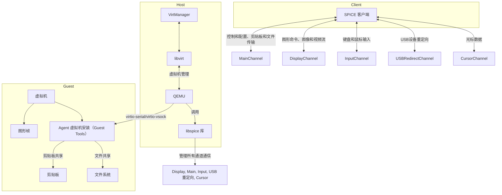

# spice

## 简介

SPICE 是一个开源的远程桌面协议，它允许用户通过网络连接到远程计算机的图形界面。SPICE 协议支持多种操作系统和硬件平台，包括 Windows、Linux 和 macOS。SPICE 协议可以在本地计算机和远程计算机之间建立安全的连接，并且可以提供高质量的图形界面。

以下是基于SPICE协议的虚拟机管理工具的架构图：

## 协议
### 字节序
* 采用LE小端字节序
* 认证机制 SASL

### 协议格式

## spice协议客户端
[客户端](client.md)

## 参考资料
* [官网协议](https://www.spice-space.org/spice-protocol.html)
* [客户端下载](https://www.spice-space.org/download.html)
* [virt-manager](https://virt-manager.org/download)
* [Spic-Guest-Tools](https://www.spice-space.org/download/windows/spice-guest-tools/spice-guest-tools-latest.exe)
  * 需要在虚拟机内安装，实现双向剪贴板，文件传输，窗口自适应等功能

## spice协议客户端
[客户端](client.md)

## 参考资料
* [官方新手入门](https://www.spice-space.org/spice-for-newbies.html)
* [官网协议](https://www.spice-space.org/spice-protocol.html)
* [客户端下载](https://www.spice-space.org/download.html)
* [virt-manager](https://virt-manager.org/download)
* [Spic-Guest-Tools](https://www.spice-space.org/download/windows/spice-guest-tools/spice-guest-tools-latest.exe)
  * 需要在虚拟机内安装，实现双向剪贴板，文件传输，窗口自适应等功能