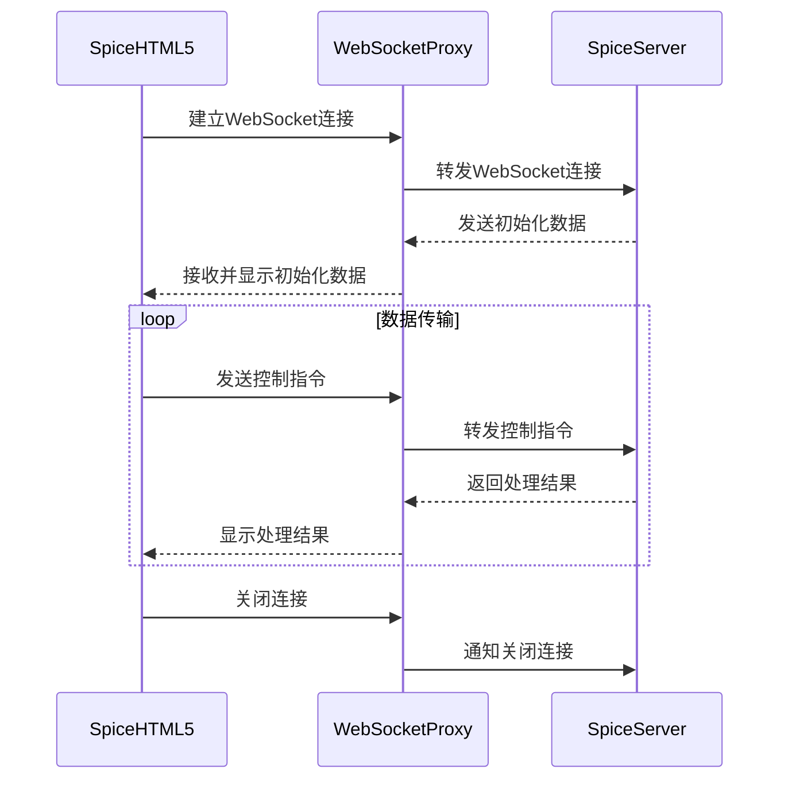

# spice

## spice协议客户端

### virt-manager
服务器端安装

### virt-viewer
* [下载地址](https://releases.pagure.org/virt-viewer/virt-viewer-x64-11.0-1.0.msi)
  
### spicehtml5
#### [Spice-HTML5仓库](https://gitlab.freedesktop.org/spice/spice-html5)
#### [WebSocket代理: websockify](https://github.com/novnc/websockify)
* websockify部署
  * 编译镜像: `cd docker && ./build.sh`
  * 修改 `docker-compose.yml` 中 `command` 中spice服务器的地址
  * 部署 `docker compose up -d`
  
#### 调用流程

* 浏览器安全限制
  * 不能使用剪贴板

## 参考资料
* [官网协议](https://www.spice-space.org/spice-protocol.html)
* [客户端下载](https://www.spice-space.org/download.html)
* [virt-manager](https://virt-manager.org/download)
* [Spic-Guest-Tools](https://www.spice-space.org/download/windows/spice-guest-tools/spice-guest-tools-latest.exe)
  * 需要在虚拟机内安装，实现双向剪贴板，文件传输，窗口自适应等功能