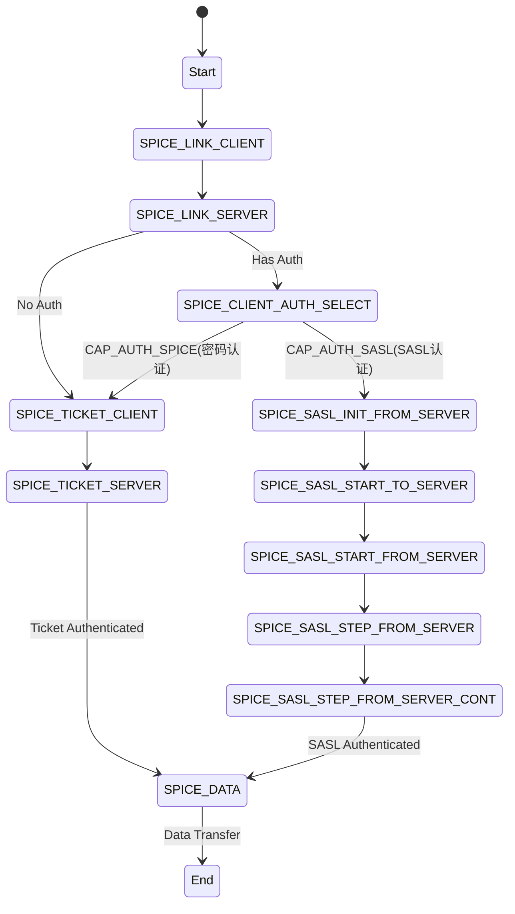
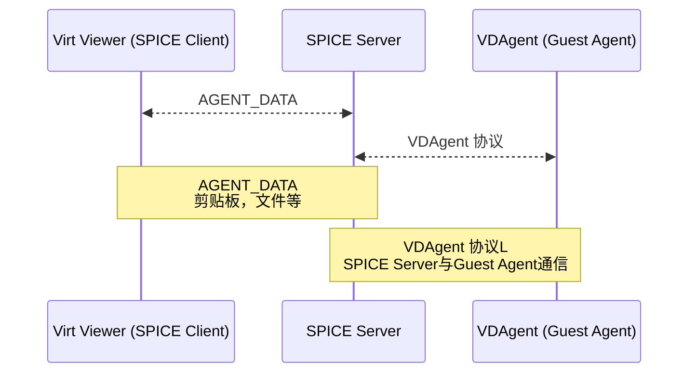

<h1 align="center">SPICE协议总结</h1>

- [1. SPICE 简介](#1-spice-简介)
- [2. SPICE架构解析](#2-spice架构解析)
  - [2.1 图形命令流](#21-图形命令流)
    - [2.1.1 主要组件及其功能](#211-主要组件及其功能)
  - [2.2 代理命令流](#22-代理命令流)
    - [2.2.1 主要组件及其功能](#221-主要组件及其功能)
  - [2.3 服务端架构](#23-服务端架构)
    - [2.3.1 主要组件及其功能](#231-主要组件及其功能)
  - [2.4 客户端架构](#24-客户端架构)
    - [主要组件及其功能](#主要组件及其功能)
- [3. SPICE协议格式](#3-spice协议格式)
  - [3.1 字节序](#31-字节序)
  - [3.2 会话管理](#32-会话管理)
    - [3.2.1 会话建立](#321-会话建立)
      - [3.2.1.1 会话协商](#3211-会话协商)
      - [3.2.1.2  会话认证](#3212--会话认证)
    - [3.2.2 数据传输](#322-数据传输)
  - [3.3 业务数据协议](#33-业务数据协议)
    - [3.3.1 VD Agent](#331-vd-agent)
      - [3.3.1.1  剪贴板](#3311--剪贴板)
      - [3.3.1.2 文件传输](#3312-文件传输)
    - [3.4 键鼠输入](#34-键鼠输入)
- [4. SPICE协议相关项目](#4-spice协议相关项目)
- [5. SPICE Guest Tools](#5-spice-guest-tools)
  - [5.1. SPICE Guest Tools 的功能](#51-spice-guest-tools-的功能)
    - [5.1.1 显示和图形优化](#511-显示和图形优化)
    - [5.1.2 输入设备集成](#512-输入设备集成)
    - [5.1.3 USB 重定向](#513-usb-重定向)
    - [5.1.4 音频支持](#514-音频支持)
    - [5.1.5 文件传输](#515-文件传输)
    - [5.1.6 其他功能](#516-其他功能)
  - [5.2. SPICE Guest Tools 的组件](#52-spice-guest-tools-的组件)
    - [5.2.1 SPICE Agent（spice-vdagent）](#521-spice-agentspice-vdagent)
    - [5.2.2 QXL 或 Virtio-GPU 驱动](#522-qxl-或-virtio-gpu-驱动)
    - [5.2.3 Virtio 驱动](#523-virtio-驱动)
    - [5.2.4 USB 重定向驱动](#524-usb-重定向驱动)
  - [5.3. 安装 SPICE Guest Tools](#53-安装-spice-guest-tools)

# 1. SPICE 简介

- 全称： Simple Protocol for Independent Computing Environments
- 是一个专为虚拟化环境设计的协议，没有 RFC 标准, 主要由 Red Hat 和其他开源社区维护。
- 最初 由 `Qumranet` 公司开发，是为其虚拟化产品（KVM 虚拟化平台）设计的, 2008 年，Red Hat 收购了 Qumranet，并将 SPICE 作为开源项目发布（2009 年）。
- 设计目标：优化虚拟化环境中的远程桌面体验，提供高性能的图形、音频和 USB 设备支持。

# 2. SPICE架构解析

[a_cmd_flow]: ./images/a_cmd_flow.png
[g_cmd_flow]: ./images/g_cmd_flow.png
[cli_bsc_stc]: ./images/cli_bsc_stc.png
[srv_stc]: ./images/srv_stc.png

在看SPICE协议之前先了解一下SPICE的整体设计，有助于理解协议相关内容。
以下内容源自官方文档[新手入门](https://www.spice-space.org/spice-for-newbies.html)

## 2.1 图形命令流

![图形命令流][g_cmd_flow]

### 2.1.1 主要组件及其功能

1. `Guest OS (客户操作系统)`
   - `User Application`: 运行在Guest OS上的应用程序。
   - `GDI/X Engine`: 图形显示接口或X服务器引擎，负责图形渲染。
   - `GDI/X to QXL`: 将GDI/X引擎生成的图形数据转换为`QXL`格式。
   - `QXL Driver`: 客户端驱动程序，用于与QEMU中的QXL设备进行通信。

2. `QEMU (虚拟机监控器)`
   - `Commands Ring`: 用于接收来自Guest OS的命令。
   - `Release Ring`: 用于释放已经处理过的命令。
   - `QXL Device`: 虚拟设备，通过QXL协议与Guest OS进行通信。
   - `Send Queue`: 用于存储待发送到Client OS的数据。
   - `Display Tree`: 存储显示树结构，用于管理显示内容。
   - `libspice`: 提供底层支持的Spice库，供QEMU使用。

3. `Client OS (客户端操作系统)`
   - `Spice Client`: 客户端软件，如virt-viewer,解析并显示接收到的图形数据。

## 2.2 代理命令流

![代理命令流][a_cmd_flow]

### 2.2.1 主要组件及其功能

1. `Guest OS (客户操作系统)`
   - `Spice Agent`: 运行在Guest OS上的代理程序，与libspice进行通信。
   - `Virtio-serial Driver`: 提供了一个虚拟化的串行设备驱动，用于与QEMU中的Virtio-serial Device进行通信。

2. `QEMU (虚拟机监控器)`
   - `Input/Output Rings`: 用于处理输入和输出操作的缓冲区。
   - `Virtio-serial Device`: QEMU中的虚拟设备，通过Virtio-serial Driver与Guest OS进行通信。
   - `libspice`: Spice服务端库，提供底层支持。
   - `Client Messages`: 客户端发送的消息。
   - `Server Messages`: 服务器返回的消息。
   - 
3. `Client OS (客户端操作系统)`
   - `Spice Client`: 客户端软件，与libspice进行通信。


## 2.3 服务端架构

![服务端架构图][srv_stc]

### 2.3.1 主要组件及其功能

1. `QEMU (虚拟机监控器)`
   - `Agent Interface`: 用于与Spice Agent进行通信。
   - `kbd, mouse & tablet Interfaces`: 处理键盘、鼠标和手写板的输入。
   - `Playback Interface`: 处理音频播放。
   - `Record Interface`: 处理音频录制。

2. `Spice Server`
   - `QXL Interface`: 负责处理图形数据的传输，并将其传递给 `Red Dispatcher`。
   - `Red Dispatcher`: 将任务分发到相应的 `Red Worker Threads`。
   - `Red Worker Threads`: 处理具体的显示和光标任务。
     - `Display Channel`: 处理显示相关的任务。
     - `Cursor Channel`: 处理光标相关的任务。
     - ...

3. `Channels`
   - `Main Channel`: 主通道，用于主要的通信和控制。
   - `Inputs Channel`: 处理输入设备（如键盘、鼠标）的数据。
   - `Playback Channel`: 处理音频播放相关的任务。
   - `Record Channel`: 处理音频录制相关的任务。

## 2.4 客户端架构

![客户端架构图][cli_bsc_stc]

### 主要组件及其功能

1. `Application`类
   - `client`: 客户端。
   - `screens`: 屏幕管理。
   - `monitors_list`: 显示器列表。
   - `main_screen`: 主屏幕。
   - `active_screen`: 活动屏幕。

2. `Monitor`类
   - 管理显示器的配置和状态。

3. `Platform`
   - 提供平台相关的接口和服务。

4. `RedClient`类
   - `channels`: 通道管理。
   - `factories`: 工厂模式创建对象。
   - `pixmap cache`: 图像缓存。
   - `migrate`: 迁移处理。

5. `RedScreen`类
   - `layers`: 层管理。
   - `window`: 窗口管理。

6. `RedChannel`类
   - `DisplayChannel`: 处理显示相关的任务。
   - `InputsChannel`: 处理输入设备（如键盘、鼠标）的数据。
   - `CursorChannel`: 处理光标相关的任务。
   - `PlaybackChannel`: 处理音频播放相关的任务。
   - `RecordChannel`: 处理音频录制相关的任务。

7. `RedWindow`类
   - `RedDrawable`: 可绘制对象。
   - `RedWindow_p`: 窗口私有数据。

8. `RedPeer`类
   - 用于通信的对等实体。

9. `ScreenLayer`类
   - 屏幕层管理。

# 3. SPICE协议格式

## 3.1 字节序

- 所有数据都以自定义结构体方式打包，字节序 采用 `Little Endian` 格式。

## 3.2 会话管理

SPICE协议采用在不同的会话状态下使用不同的数据结构来组织数据，管理较为复杂。通过给其定义不同的会话状态，有助于协议理解。会话状态迁移图如下所示：



上图的会话状态是参考wireshark的spice协议解析代码，spice源码中没有相应的状态定义。

### 3.2.1 会话建立

#### 3.2.1.1 会话协商

- 共用header
  
   ```bash
   # Spice 链路头
   type SpiceLinkHeader = unit {
      magic: uint32;         # 魔数，用于标识协议 "REDQ"
      major_version: uint32; # 主版本号
      minor_version: uint32; # 次版本号
      size: uint32;          # 消息体大小
   };
   ```

- 客户端发送连接请求
  - 状态: `SPICE_LINK_CLIENT`
  - 数据结构: `ClientLink`

   ```bash
         # 链路消息 C2S 消息
      type SpiceLinkMess = unit {
         connection_id: uint32;        # 连接ID，用于标识不同的连接
         channel_type: uint8;          # 通道类型，用于标识不同的通道类型
         channel_id: uint8;            # 通道ID，用于标识不同的通道
         num_common_caps: uint32;      # 通用能力数量，用于标识支持的通用能力数量
         num_channel_caps: uint32;     # 通道能力数量，用于标识支持的通道能力数量
         caps_offset: uint32;          # 能力偏移量，用于标识能力列表的偏移量
         common_caps: bitfield (32) {
            auth_selection : 0;        # 认证选择
            auth_spice: 1;             # Spice 认证
            auth_sasl : 2;             # SASL 认证
            use_mini_header : 3;       # 使用迷你头
         };
         channel_caps : bitfield (32) {
            semi_miragation : 0;      # 半迁移
            vm_name : 1;              # 虚拟机名称
            agent_token : 2;          # 代理令牌
            miragation : 3;           # 迁移
         };
      } &byte-order=spicy::ByteOrder::Little;
   

      public type ClientLink = unit {
         header: SpiceLinkHeader;
         message: SpiceLinkMess;
      };
   ```

- 重点关注的字段
  - connection_id: 会话ID，Main通道建立第一个连接时，此时给客户端ID为0，待会话建立成功后，服务端会返回一个唯一的会话ID，后续所有通道连接时，使用该ID进行连接。
  - channel_type: 通道类型，SPICE协议定义了多种通道类型，用于不同的业务场景。每个通道一个连接。
    - 类型枚举:

      ```bash
        # 通道类型枚举
        public type SpiceChannelType = enum {
           SPICE_CHANNEL_MAIN = 1,
           SPICE_CHANNEL_DISPLAY,
           SPICE_CHANNEL_INPUTS,
           SPICE_CHANNEL_CURSOR,
           SPICE_CHANNEL_PLAYBACK,
           SPICE_CHANNEL_RECORD,
           SPICE_CHANNEL_TUNNEL,
           SPICE_CHANNEL_SMARTCARD,
           SPICE_CHANNEL_USBREDIR,
           SPICE_CHANNEL_PORT,
           SPICE_CHANNEL_WEBDAV,

           SPICE_END_CHANNEL
        };
      ```
  - common_caps: 能力值, SPICE会根据能力值的设定来做相应分支选择处理。
  - use_mini_header: 是否使用迷你格式。

- 服务端返回连接确认
  
  - 状态: `SPICE_LINK_SERVER`
  - 数据结构: `ServerLink`

    ```bash
      # Spice 链路回复 S2C 消息
      type SpiceLinkReply = unit {
         error: uint32;                                    # 错误码，用于标识回复中的错误状态
         pub_key: bytes &size=SPICE_TICKET_PUBKEY_BYTES;    # 公钥，用于加密和解密数据
         num_common_caps: uint32;                           # 通用能力数量，用于标识支持的通用能力数量
         num_channel_caps: uint32;                          # 通道能力数量，用于标识支持的通道能力数量
         caps_offset: uint32;                               # 能力偏移量，用于标识能力列表的偏移量
         common_caps: bitfield (32) {
            auth_selection : 0;        # 是否需要认证
            auth_spice : 1;            # Spice 认证
            auth_sasl : 2;             # SASL 认证
            use_mini_header: 3;        # 使用迷你头
         };
         channel_caps : bitfield (32) {
            semi_miragation: 0;       # 半迁移
            vm_name : 1;              # 虚拟机名称
            agent_token : 2;          # 代理令牌
            miragation : 3;           # 迁移
         };
      } &byte-order=spicy::ByteOrder::Little;
      public type ServerLink = unit {
         header: SpiceLinkHeader;
         message: SpiceLinkReply;
      };
    ```

- 重点关注的字段
  - 同客户端。最终使用双发协商出来的能力值。


#### 3.2.1.2  会话认证

根据双方的能力值`auth_selection`，选择认证流程。

- 客户端向服务器发起的认证请求。
  - 状态: `SPICE_CLIENT_AUTH_SELECT`
  - 数据结构：

      ```bash
      # Spice 链路认证机制 C2S 消息
      type SpiceLinkAuthMechanism = unit{
         auth_mechanism: uint32; # 认证机制，用于标识使用的认证机制
      };
      ```

- 客户端向服务端发送加密Ticket。
  - 状态: `SPICE_TICKET_CLIENT`
  - 数据结构:

      ```bash
         # 加密的票据数据 C2S 消息
         type SpiceLinkEncryptedTicket  = unit{
            encrypted_data: bytes &size=128; # 存储加密后的票据数据的字节数组
         };
      ```

- 服务器向客户端发送认证结果。
  - 状态: `SPICE_TICKET_SERVER`
  - 数据结构:

      ```bash
      type SpiceLinkResult  = unit{
         error: uint32 &byte-order=spicy::ByteOrder::Little;
      };
      ```

    - error: 错误码，用于标识回复中的错误状态,为`SPICE_LINK_ERR_OK`时，通道建立成功，后续进行业务数据的传输。
    - 枚举值(参考`enums.h`)如下：

      ```c
      typedef enum SpiceLinkErr {
         SPICE_LINK_ERR_OK, //表示没有错误发生，链接操作成功
         SPICE_LINK_ERR_ERROR, // 表示发生了一般性错误，具体原因未指定
         SPICE_LINK_ERR_INVALID_MAGIC, // 表示接收到的链接数据的魔数（magic number）无效
         SPICE_LINK_ERR_INVALID_DATA, // 表示接收到的链接数据无效或格式不正确
         SPICE_LINK_ERR_VERSION_MISMATCH, // 表示链接双方的版本不匹配，无法建立或继续链接
         SPICE_LINK_ERR_NEED_SECURED, // 表示链接需要进行安全加密，但当前未加密
         SPICE_LINK_ERR_NEED_UNSECURED, // 表示链接需要进行非安全加密，但当前已加密
         SPICE_LINK_ERR_PERMISSION_DENIED, // 表示当前用户没有权限进行链接操作
         SPICE_LINK_ERR_BAD_CONNECTION_ID, // 表示接收到的连接ID无效，无法识别或使用
         SPICE_LINK_ERR_CHANNEL_NOT_AVAILABLE, //表示请求的通道不可用，无法建立或使用链接
         SPICE_LINK_ERR_ENUM_END
      };
      ```

### 3.2.2 数据传输

- 状态: `SPICE_DATA`
- 实现具体的业务功能数据的传输
- 数据结构: 根据能力值`use_mini_header` 选择使用不同的结构体传输数据，默认使用的是mini格式。
  - 标准格式数据

     ```bash
     type SpiceDataHeader   = unit{
         serial : uint64; #数据的序列号
         msg_type : uint16; # 数据的类型
         msg_size : uint32; # 数据的大小
         sub_list : uint32; #offset to SpiceSubMessageList[] # 子消息列表的偏移量
      };


      type SpiceSubMessage = unit {
         msg_type : uint16;
         msg_size : uint32;
      };

      type SpiceSubMessageList = unit {
         size : uint16;
         sub_messages: uint32[]; #offsets to SpicedSubMessage
      };
      ```

  - 迷你格式数据

      ```bash
      # 迷你格式数据头。
      type SpiceMiniDataHeader = unit {
         msg_type : uint16; # 数据的类型
         msg_size : uint32; # 数据的大小
      };

      # 迷你格式数据。
      public type SpiceMiniData = unit {
         header : SpiceMiniDataHeader;
         switch ( self.header.msg_type ) {
            # 根据消息类型选用不同的数据结构。
            104 -> agent_data: VDAgentMessage &size=self.header.msg_size; # 只解析代理数据
            * -> :bytes &size=self.header.msg_size; # default: raw_data原始数据
         };
      };
     ```

- 消息类型，参考协议接口`enums.h`文件。
  - 各通道通用的消息类型。

      ```bash
      type SpiceMessageType = enum {
         SPICE_MSG_MIGRATE = 1,      # 迁移消息，用于在不同主机之间迁移会话
         SPICE_MSG_MIGRATE_DATA,     # 迁移数据消息，用于传输迁移过程中的数据
         SPICE_MSG_SET_ACK,          # 设置确认消息，用于确认设置操作的完成
         SPICE_MSG_PING,             # 心跳消息，用于检测连接的存活状态
         SPICE_MSG_WAIT_FOR_CHANNELS,# 等待通道消息，用于等待特定通道的建立
         SPICE_MSG_DISCONNECTING,    # 断开连接消息，用于通知对方即将断开连接   
         SPICE_MSG_NOTIFY,           # 通知消息，用于向对方发送通知
         SPICE_MSG_LIST,             # 列表消息，用于请求或发送列表数据
         SPICE_MSG_BASE_LAST = 100,  # 基础消息类型的结束，用于标记枚举的边界
      };
      ```

      `SPICE_MSG_PING`消息除了是心跳的功能外，还有一个作用是用来检测网络带宽，解析时需要通过header中定义的大小读干净，不然会影响后面报文的解析。服务端发送ping有时会带一个64K的空数据。以下是`SPICE_MSG_PING`消息的定义。

      ```bash
      type SpiceMsgPing = unit {
         id : uint32; # ping id
         timestamp : uint64; # ping timestamp
      };
      ```

  - 每个通道的每个方向都定义了一套自己的消息集，，从101开始往后排。每个消息又会对应相应数据结构。
  - 以 `main` 通道为例
    - S2C 方向

      ```c
      enum {
         SPICE_MSG_MAIN_MIGRATE_BEGIN = 101,
         SPICE_MSG_MAIN_MIGRATE_CANCEL,
         SPICE_MSG_MAIN_INIT,
         SPICE_MSG_MAIN_CHANNELS_LIST,
         SPICE_MSG_MAIN_MOUSE_MODE,
         SPICE_MSG_MAIN_MULTI_MEDIA_TIME,
         SPICE_MSG_MAIN_AGENT_CONNECTED,
         SPICE_MSG_MAIN_AGENT_DISCONNECTED,
         SPICE_MSG_MAIN_AGENT_DATA,
         SPICE_MSG_MAIN_AGENT_TOKEN,
         SPICE_MSG_MAIN_MIGRATE_SWITCH_HOST,
         SPICE_MSG_MAIN_MIGRATE_END,
         SPICE_MSG_MAIN_NAME,
         SPICE_MSG_MAIN_UUID,
         SPICE_MSG_MAIN_AGENT_CONNECTED_TOKENS,
         SPICE_MSG_MAIN_MIGRATE_BEGIN_SEAMLESS,
         SPICE_MSG_MAIN_MIGRATE_DST_SEAMLESS_ACK,
         SPICE_MSG_MAIN_MIGRATE_DST_SEAMLESS_NACK,

         SPICE_MSG_END_MAIN
      };
      ```

      - 此处重点关注 `SPICE_MSG_MAIN_INIT`, 这里会生成会话ID，将所有的连接管理起来。
      - 对应的数据结构如下：

        ```c
          typedef struct SpiceMsgMainInit {
            UINT32 session_id; //session id is generated by the server. This id will be send on every new channel connection within this session (i.e., in SpiceLinkMess.connection_id).
            UINT32 display_channels_hint; //optional hint of expected number of display channels. Zero is defined as an invalid value
            UINT32 supported_mouse_modes;//supported mouse modes. This is any combination of SPICE_MOUSE_MODE_?
            UINT32 current_mouse_mode;//the current mouse mode, one of SPICE_MOUSE_MODE_?
            UINT32 agent_connected;//current state of Spice agent (see This Section), 0 and 1 stand for disconnected and connected state respectively.
            UINT32 agent_tokens;//number of available tokens for sending messages to Spice agent.
            UINT32 multi_media_time;//current server multimedia time. The multimedia time is used for synchronizing video (for more information see Multimedia time)
            UINT32 ram_hint;//optional hint for help in determining global LZ compression dictionary size (for more information see section Spice Image in “Display Channel”)
          }
        ```

    - C2S 方向

      ```c
      enum {
         SPICE_MSGC_MAIN_CLIENT_INFO = 101,
         SPICE_MSGC_MAIN_MIGRATE_CONNECTED,
         SPICE_MSGC_MAIN_MIGRATE_CONNECT_ERROR,
         SPICE_MSGC_MAIN_ATTACH_CHANNELS,
         SPICE_MSGC_MAIN_MOUSE_MODE_REQUEST,
         SPICE_MSGC_MAIN_AGENT_START,
         SPICE_MSGC_MAIN_AGENT_DATA,
         SPICE_MSGC_MAIN_AGENT_TOKEN,
         SPICE_MSGC_MAIN_MIGRATE_END,
         SPICE_MSGC_MAIN_MIGRATE_DST_DO_SEAMLESS,
         SPICE_MSGC_MAIN_MIGRATE_CONNECTED_SEAMLESS,
         SPICE_MSGC_MAIN_QUALITY_INDICATOR,

         SPICE_MSGC_END_MAIN
      };
      ```

## 3.3 业务数据协议

以下主要介绍剪贴板，文件传输，键鼠输入相关的数据协议。
由于剪贴板和文件传输都是基于VD Agent的扩展功能，是一个子协议，我们先了解一下VDAgent。

### 3.3.1 VD Agent

- VDAgent（Virtual Desktop Agent）是 SPICE 协议的一部分，它运行在虚拟机内部，作为客户端与虚拟机之间的中间代理，负责处理虚拟机与宿主机相关的通信和功能增强。VDAgent 提供了多种服务，优化了虚拟化环境中的用户体验。它随[`SPICE Guest Tools`](#5-spice-guest-tools) 安装在虚拟机中运行。
- VDAgent 协议（Virtual Desktop Agent Protocol）是 SPICE 协议的重要组成部分，用于虚拟机中的 SPICE Agent 与宿主机的 SPICE Server 之间的通信。该协议支持多种功能，例如剪贴板共享、显示分辨率调整、文件传输、监控配置更新等，增强了虚拟机的用户体验和管理能力。
- AGENT_DATA 是一种用于客户端和 SPICE Server 之间传递与 VDAgent（虚拟机代理）相关数据的指令。它是客户端和服务端之间进行 VDAgent 功能通信的桥梁，包括剪贴板、文件传输、会话状态等功能。



- AGENT_DATA 传输通道: `SPICE_CHANNEL_MAIN`
- 指令:
  - C2S: `SPICE_MSGC_MAIN_AGENT_DATA`
  - S2C: `SPICE_MSG_MAIN_AGENT_DATA`
- 接口定义: `SPICE Protocol`的`vd_agent.h`文件
- 消息格式：
  - 结构体：

   ```c
   #define VD_AGENT_PROTOCOL 1
   typedef struct SPICE_ATTR_PACKED VDAgentMessage
   {
      
      uint32_t protocol; /* 必须是VD_AGENT_PROTOCOL */      
      uint32_t type; /* 下面枚举中的VD_AGENT_xxx之一 */
      uint64_t opaque;
      uint32_t size;/* 随后数据的大小 */
      uint8_t data[0]; /* 数据区 */
   } VDAgentMessage;
  ```

- 支持的消息类型:

   ```c
   enum
   {
      VD_AGENT_MOUSE_STATE = 1, /* server -> agent 服务器向代理发送鼠标状态信息 */
      VD_AGENT_MONITORS_CONFIG, /* client -> agent|server. 客户端向代理或服务器发送监视器配置信息 */
      VD_AGENT_REPLY, /* agent -> client.代理向客户端发送回复信息 */
      VD_AGENT_CLIPBOARD, /* 设置剪贴板数据（双向） */
      VD_AGENT_DISPLAY_CONFIG, /* client -> agent.客户端向代理发送显示配置信息 */
      VD_AGENT_ANNOUNCE_CAPABILITIES, /* 代理宣布其能力 */
      VD_AGENT_CLIPBOARD_GRAB, /* 请求监听剪贴板变化（双向） */
      VD_AGENT_CLIPBOARD_REQUEST, /* 请求剪贴板数据（双向） */
      VD_AGENT_CLIPBOARD_RELEASE, /* 释放剪贴板 */
      VD_AGENT_FILE_XFER_START, /* 文件传输开始 */
      VD_AGENT_FILE_XFER_STATUS, /* 文件传输状态 */
      VD_AGENT_FILE_XFER_DATA, /* 文件传输数据 */
      VD_AGENT_CLIENT_DISCONNECTED, /* 客户端断开连接 */
      VD_AGENT_MAX_CLIPBOARD, /* 最大剪贴板 */
      VD_AGENT_AUDIO_VOLUME_SYNC, /* 音频音量同步 */
      VD_AGENT_GRAPHICS_DEVICE_INFO, /* 图形设备信息 */
      VD_AGENT_END_MESSAGE,
   };
   ```

#### 3.3.1.1  剪贴板

- 剪贴板相关的消息类型：
  - `VD_AGENT_CLIPBOARD`
  - `VD_AGENT_CLIPBOARD_GRAB`
  - `VD_AGENT_CLIPBOARD_REQUEST`
  - `VD_AGENT_CLIPBOARD_RELEASE`
- 剪贴板内容消息类型： `VD_AGENT_CLIPBOARD`
- 数据结构:

   ```c
   typedef struct SPICE_ATTR_PACKED VDAgentClipboard
   {
      uint32_t type;   /* 剪贴板的类型 */
      uint8_t data[0]; /* 剪贴板的数据 */
   } VDAgentClipboard;
   ```

  - `type`：剪贴板的类型，如文本、图像等

      ```c
      enum
      {
         VD_AGENT_CLIPBOARD_NONE = 0,   /* 无剪贴板数据 */
         VD_AGENT_CLIPBOARD_UTF8_TEXT,  /* UTF-8编码的文本 */
         VD_AGENT_CLIPBOARD_IMAGE_PNG,  /* PNG格式的图像（所有支持图像的客户端应支持此格式） */
         VD_AGENT_CLIPBOARD_IMAGE_BMP,  /* BMP格式的图像（可选） */
         VD_AGENT_CLIPBOARD_IMAGE_TIFF, /* TIFF格式的图像（可选） */
         VD_AGENT_CLIPBOARD_IMAGE_JPG,  /* JPG格式的图像（可选） */
         VD_AGENT_CLIPBOARD_FILE_LIST,  /* 与org.spice-space.webdav.0 webdav通道关联的绝对路径列表；
                                          * 列表项以UTF-8编码并用'\0'分隔；
                                          * 第一个项必须是"copy"或"cut"（不带引号），
                                          * 以指示应如何处理后续文件 */
      };
      ```

#### 3.3.1.2 文件传输

- 文件传输相关的消息类型：
  - `VD_AGENT_FILE_XFER_START`: 文件传输开始，包含文件名和文件大小
  - `VD_AGENT_FILE_XFER_STATUS`：文件传输状态，包含文件传输进度
  - `VD_AGENT_FILE_XFER_DATA`：文件传输数据，包含文件数据
- 数据结构:
  - 开始传输的消息：

      ```c
      typedef struct SPICE_ATTR_PACKED VDAgentFileXferStartMessage
      {
         uint32_t type;
         uint32_t size;
         uint8_t data[0];
      } VDAgentFileXferStartMessage;
      ```

      data 中的内容为ini格式的数据

      ```ini
      [agent-file-transfer]
      name=file.txt
      size=1024
      ```

  - 状态消息：

      ```c
      typedef struct SPICE_ATTR_PACKED VDAgentFileXferStatusMessage
      {
      uint32_t type;
      uint32_t size;
      uint8_t data[0];
      } VDAgentFileXferStatusMessage;
      ```

  - 数据消息：
    - 需要关注的是：文件的第一个包用的是这个结构，第二个包只有data部分了

      ```c
      typedef struct SPICE_ATTR_PACKED VDAgentFileXferDataMessage
      {
         uint32_t type;
         uint32_t size;
         uint8_t data[0];
      } VDAgentFileXferDataMessage;
      ```

### 3.4 键鼠输入

- 通道类型: `SPICE_CHANNEL_INPUTS`
- 键鼠输入相关的消息类型：

  ```c
   // S2C 方向
   typedef enum {
      SPICE_MSG_INPUTS_INIT = 101, // 键鼠初始状态 SpiceMsgInputsInit
      SPICE_MSG_INPUTS_KEY_MODIFIERS,  // 键盘修饰符消息 SpiceMsgInputsKeyModifiers
      SPICE_MSG_INPUTS_MOUSE_MOTION_ACK = 111, // 鼠标移动确认消息

      SPICE_MSG_END_INPUTS
   };
   // C2S 方向
   enum {
      SPICE_MSGC_INPUTS_KEY_DOWN = 101, //键盘按下消息 对应 SpiceMsgcKeyDown
      SPICE_MSGC_INPUTS_KEY_UP, // 键盘抬起消息 对应 SpiceMsgcKeyUp
      SPICE_MSGC_INPUTS_KEY_MODIFIERS, //键盘修饰符消息 对应 SpiceMsgcKeyModifiers
      SPICE_MSGC_INPUTS_KEY_SCANCODE, // 键盘扫描码消息 对应 uint8_t scancode
      SPICE_MSGC_INPUTS_MOUSE_MOTION = 111, // 鼠标移动消息 对应 SpiceMsgcMouseMotion
      SPICE_MSGC_INPUTS_MOUSE_POSITION, // 鼠标位置消息 对应 SpiceMsgcMousePosition
      SPICE_MSGC_INPUTS_MOUSE_PRESS, // 鼠标按下消息 对应 SpiceMsgcMousePress
      SPICE_MSGC_INPUTS_MOUSE_RELEASE, // 鼠标抬起消息 对应 SpiceMsgcMouseRelease

      SPICE_MSGC_END_INPUTS
   };
  ```

  - 键鼠通道相关的消息结构：
  ```c
   typedef struct SpiceMsgcKeyDown {
      uint32_t code;
   } SpiceMsgcKeyDown;

   typedef struct SpiceMsgcKeyUp {
      uint32_t code;
   } SpiceMsgcKeyUp;

   typedef struct SpiceMsgcKeyModifiers {
      uint16_t modifiers;
   } SpiceMsgcKeyModifiers;

   typedef struct SpiceMsgcMouseMotion {
      int32_t dx;
      int32_t dy;
      uint16_t buttons_state;
   } SpiceMsgcMouseMotion;

   typedef struct SpiceMsgcMousePosition {
      uint32_t x;
      uint32_t y;
      uint16_t buttons_state;
      uint8_t display_id;
   } SpiceMsgcMousePosition;

   typedef struct SpiceMsgcMousePress {
      uint8_t button;
      uint16_t buttons_state;
   } SpiceMsgcMousePress;

   typedef struct SpiceMsgcMouseRelease {
      uint8_t button;
      uint16_t buttons_state;
   } SpiceMsgcMouseRelease;

   typedef struct SpiceMsgInputsInit {
      uint16_t keyboard_modifiers;
   } SpiceMsgInputsInit;

   typedef struct SpiceMsgInputsKeyModifiers {
      uint16_t modifiers;
   } SpiceMsgInputsKeyModifiers;
  ```

# 4. SPICE协议相关项目

- [spice-protocol](https://gitlab.freedesktop.org/spice/spice-protocol) : 描述消息类型，通用的的消息结构，如会话建立阶段的消息定义, agent相关的消息定义。
- [spice-common](https://gitlab.freedesktop.org/spice/spice-common) : 公用库，包含通道业务数据消息定义(spice.proto)，协议解析(自动化生成)，图像编解码，压缩相关等。
- [libspice](https://gitlab.freedesktop.org/spice/spice): SPICE协议的服务端实现，参考[服务端架构](#23-服务端架构)
- [spice-gtk](https://gitlab.freedesktop.org/spice/spice-gtk) : SPICE协议的客户端实现，参考[客户端架构](#24-客户端架构)
- [virt-viewer](https://pagure.io/virt-viewer) : Virt Viewer客户端，基于SPICE gtk
- [spice-html5](https://gitlab.freedesktop.org/spice/spice-html5)：一个基于Web技术的SPICE客户端，支持在浏览器中通过SPICE协议访问。
- 以上项目的依赖关系图：

   ```mermaid
   flowchart TD
      libspice["libspice"] --> Common["Common"]
      virt-viewer["virt-viewer"] --> spice-gtk["spice-gtk"]
      spice-gtk --> Common
      Common --> Protocol["Protocol"]
      spice-html5 --> WebSocket2TCP
   ```

# 5. SPICE Guest Tools

`SPICE Guest Tools` 是一组为虚拟机（VM）提供的驱动程序和工具，旨在增强虚拟机的功能和性能，特别是在使用 `SPICE`协议进行远程桌面访问时。SPICE Guest Tools 通常安装在虚拟机操作系统中，以提供更好的集成和用户体验。

## 5.1. SPICE Guest Tools 的功能

SPICE Guest Tools 提供了以下主要功能：

### 5.1.1 显示和图形优化

- `动态分辨率调整`：
  - 允许虚拟机根据客户端窗口的大小自动调整显示分辨率。
- `多显示器支持`：
  - 支持在虚拟机中使用多个显示器。
- `图形加速`：
  - 通过 Virtio-GPU 或 QXL 驱动提供图形加速，提升图形性能。

### 5.1.2 输入设备集成

- `鼠标集成`：
  - 提供无缝的鼠标指针集成，避免鼠标指针偏移或滞后。
- `剪贴板共享`：
  - 支持宿主机和虚拟机之间的剪贴板共享，方便复制和粘贴文本、文件等。

### 5.1.3 USB 重定向

- `USB 设备支持`：
  - 允许将宿主机的 USB 设备（如 USB 存储设备、打印机、摄像头等）重定向到虚拟机中使用。

### 5.1.4 音频支持

- 音频重定向：
  - 支持将虚拟机的音频重定向到客户端，提供更好的音频体验。

### 5.1.5 文件传输

- 文件共享：
  - 支持在宿主机和虚拟机之间传输文件。

### 5.1.6 其他功能

- 时间同步：
  - 确保虚拟机的时间与宿主机同步。
- 无缝模式：
  - 支持无缝窗口模式，使虚拟机应用程序看起来像在本地运行。

---

## 5.2. SPICE Guest Tools 的组件

SPICE Guest Tools 通常包含以下组件：

### 5.2.1 SPICE Agent（spice-vdagent）

- `功能`：
  - 提供剪贴板共享、鼠标集成、动态分辨率调整等功能。
- `服务`：
  - 在 Linux 虚拟机中，`spice-vdagent` 是一个守护进程，负责与 SPICE 客户端通信。

### 5.2.2 QXL 或 Virtio-GPU 驱动

- `功能`：
  - 提供图形加速支持，优化虚拟机的显示性能。
- `适用系统`：
  - QXL 驱动通常用于 Windows 虚拟机，而 Virtio-GPU 驱动用于 Linux 虚拟机。

### 5.2.3 Virtio 驱动

- `功能`：
  - 提供 Virtio 设备的支持，包括 Virtio 网络、块设备、输入设备等。
- `适用系统`：
  - 主要用于 Linux 虚拟机，Windows 虚拟机需要单独安装 Virtio 驱动。

### 5.2.4 USB 重定向驱动

- `功能`：
  - 支持 USB 设备的重定向。
- `适用系统`：
  - 需要在虚拟机中安装相应的 USB 驱动。

---

## 5.3. 安装 SPICE Guest Tools

[官方下载](https://www.spice-space.org/download.html) 下载平台相关的安装包，根据虚拟机的操作系统进行安装。安装完成后，需要重启虚拟机以使更改生效。
