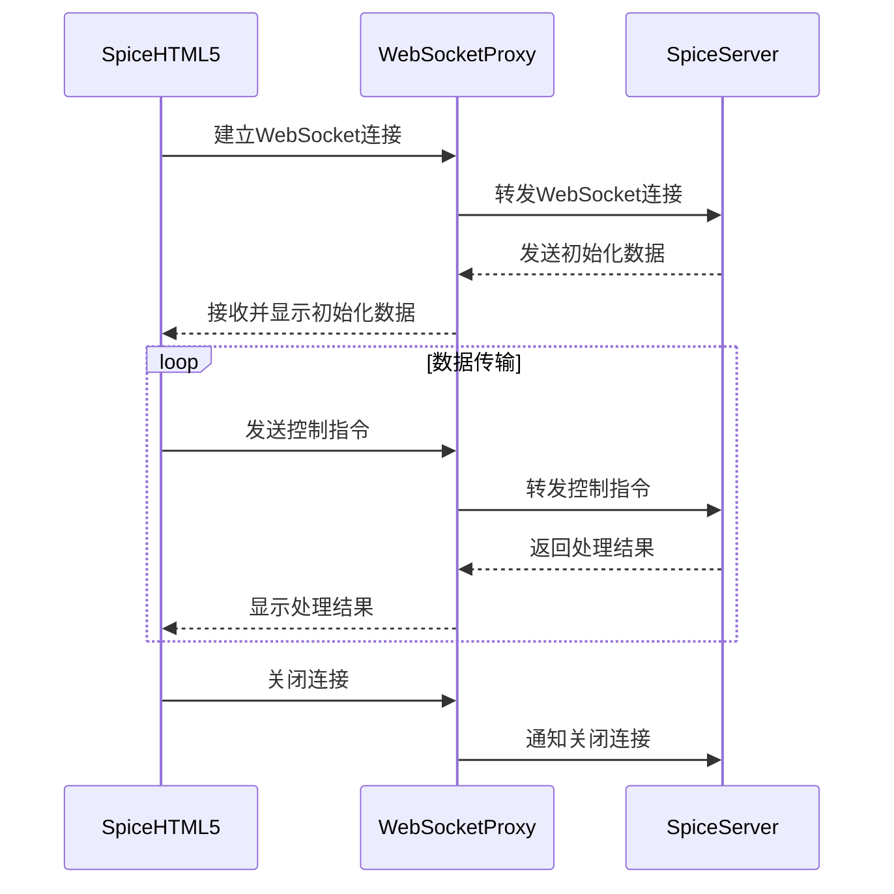

# virt-manager
服务器端安装

# virt-viewer
* [下载地址](https://releases.pagure.org/virt-viewer/virt-viewer-x64-11.0-1.0.msi)
  
# spicehtml5
## [Spice-HTML5仓库](https://gitlab.freedesktop.org/spice/spice-html5)
* 下载源码
* 使用webserver部署, README里说可以直接访问，其实不行，会有跨域访问问题
## [WebSocket代理: websockify](https://github.com/novnc/websockify)
* websockify部署
  * 编译镜像: `cd docker && ./build.sh`
  * 修改 `docker-compose.yml` 中 `command` 中spice服务器的地址
  * 部署 `docker compose up -d`
  
## 调用流程

* 浏览器安全限制
  * 不能使用剪贴板