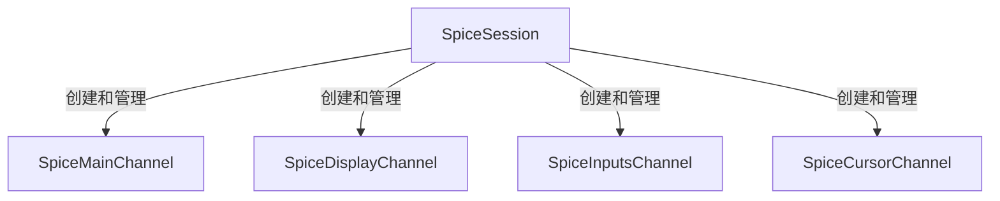
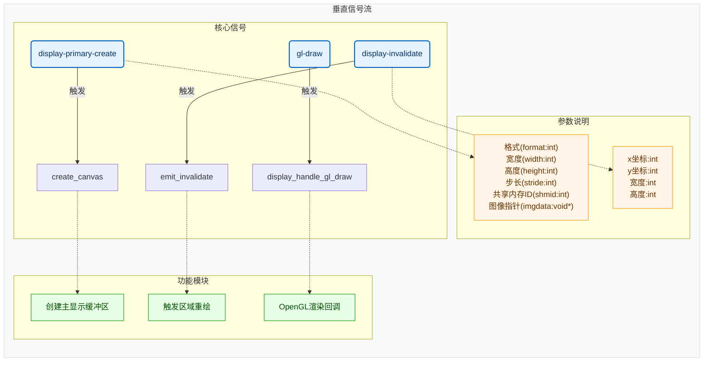

# 图

## 1.1 会话管理



### 1.1.1 连接流程

 ```mermaid
graph TD   
    subgraph 连接流程
        F[创建Session] --> G[设置属性]
        G --> H[spice_session_connect]
        H --> I[建立TCP/TLS连接]
        I --> J[创建MainChannel]
        J --> K[协商协议版本]
        K --> L[创建其他Channels]
    end
```

## 1.2 通道交互
```mermaid
graph TD  
    subgraph 通道交互
        B[主通道] -->|发送控制消息| C[显示通道]
        B -->|迁移管理| L[其他通道]
        B -->|代理通信| M[SpiceAgent]
        D[键鼠通道] -->|发送输入事件| N[服务端]
        C -->|接收显示数据| O[渲染模块]
        E[光标通道] -->|处理光标形状| P[UI显示]
    end
 ```

## 1.3 关键机制

 ```mermaid
graph TD   
    subgraph 关键机制
        Q[信号机制] -->|channel-new| R[新通道通知]
        Q -->|disconnected| S[清理资源]
        T[协程处理] -->|异步消息| U[消息队列]
        V[缓存管理] -->|图像/调色板| W[显示优化]
    end
```

# 2 消息与信号

## 2.1 主通道

### 2.1.1 主通道客户端消息

以下是基于代码分析的SPICE主通道客户端主动消息处理机制表格：

| 消息类型(枚举值)                     | 触发事件       | 接口函数                                       | 接口参数                                                              | 功能描述                                |
| ------------------------------------ | -------------- | ---------------------------------------------- | --------------------------------------------------------------------- | --------------------------------------- |
| SPICE_MSGC_MAIN_MONITORS_CONFIG      | 显示器布局变更 | spice_main_channel_send_monitor_config         | 无                                                                    | 发送客户端多显示器配置信息              |
| SPICE_MSGC_MAIN_CLIPBOARD_GRAB       | 剪贴板抓取事件 | spice_main_channel_clipboard_selection_grab    | selection(剪贴板标识), types(数据类型数组), ntypes(类型数量)          | 声明剪贴板所有权                        |
| SPICE_MSGC_MAIN_CLIPBOARD_REQUEST    | 剪贴板数据请求 | spice_main_channel_clipboard_selection_request | selection(剪贴板标识), type(请求数据类型)                             | 向服务端请求剪贴板内容                  |
| SPICE_MSGC_MAIN_CLIPBOARD_NOTIFY     | 剪贴板内容更新 | spice_main_channel_clipboard_selection_notify  | selection(剪贴板标识), type(数据类型), data(数据指针), size(数据大小) | 通知服务端剪贴板内容变更                |
| SPICE_MSGC_MAIN_FILE_XFER_START      | 文件拖放操作   | spice_main_channel_file_copy_async             | sources(源文件数组), flags(复制标志)                                  | 发起客户端到服务端的文件传输            |
| SPICE_MSGC_MAIN_MOUSE_MODE_REQUEST   | 鼠标模式切换   | spice_main_channel_request_mouse_mode          | mode(模式枚举值)                                                      | 设置服务端鼠标模式（客户端/服务端控制） |
| SPICE_MSGC_MAIN_AGENT_DATA           | 客户端代理事件 | spice_main_agent_data                          | data(代理数据指针), size(数据大小)                                    | 发送客户端代理数据（剪贴板/文件传输等） |
| SPICE_MSGC_MAIN_MIGRATE_DST_SEAMLESS | 无缝迁移请求   | spice_main_migrate_seamless                    | session(目标会话), dst_host(目标主机), dst_port(目标端口)             | 发起无缝迁移到目标主机                  |

### 2.1.2 主通道服务端消息

| 消息类型(枚举值)                | 消息处理函数           | 触发信号名称        | 信号参数                                          | 界面响应函数           | 功能描述                          |
| ------------------------------- | ---------------------- | ------------------- | ------------------------------------------------- | ---------------------- | --------------------------------- |
| SPICE_MSG_MAIN_INIT             | handle_main_init       | main-initialized    | session_id(会话ID), mouse_modes(鼠标模式)         | update_mouse_mode      | 初始化主通道参数，协商客户端能力  |
| SPICE_MSG_MAIN_MOUSE_MODE       | handle_mouse_mode      | main-mouse-update   | supported_modes(支持模式), current_mode(当前模式) | try_mouse_grab         | 更新鼠标模式（客户端/服务端控制） |
| SPICE_MSG_MAIN_CLIPBOARD        | handle_clipboard       | clipboard-selection | selection(剪贴板类型), data(数据)                 | clipboard_notify       | 同步剪贴板数据到本地系统          |
| SPICE_MSG_MAIN_AGENT_TOKEN      | handle_agent_tokens    | agent-added         | num_tokens(令牌数量)                              | update_agent_connected | 更新VDI代理连接状态               |
| SPICE_MSG_MAIN_MIGRATE_SWITCH   | handle_migrate_switch  | migrate-switch      | host(主机), port(端口)                            | spice_session_connect  | 处理无缝迁移请求                  |
| SPICE_MSG_MAIN_CHANNELS_LIST    | handle_channels_list   | channel-new         | channels(通道列表)                                | channel_created        | 创建新通道（显示/输入/音频等）    |
| SPICE_MSG_MAIN_MULTI_MEDIA_TIME | handle_mm_time         | multimedia-time     | time(时间戳)                                      | queue_draw_area        | 同步多媒体播放时间戳              |
| SPICE_MSG_MAIN_NAME             | handle_name            | notify::name        | name(虚拟机名称)                                  | update_window_title    | 更新虚拟机显示名称                |
| SPICE_MSG_MAIN_UUID             | handle_uuid            | notify::uuid        | uuid(虚拟机UUID)                                  | 无                     | 设置虚拟机唯一标识                |
| SPICE_MSG_MAIN_AGENT_CONNECTED  | handle_agent_connected | agent-connected     | 无                                                | clipboard_sync         | 通知VDI代理连接成功               |
| SPICE_MSG_MAIN_MIGRATE_BEGIN    | handle_migrate_begin   | migrate-begin       | dst_info(目标信息)                                | disconnect_channels    | 开始迁移流程，断开非必要通道      |
| SPICE_MSG_MAIN_DISCONNECTING    | handle_disconnecting   | channel-destroy     | reason(断开原因)                                  | session_cleanup        | 清理会话资源                      |


- 关键处理流程说明：
  - 通道管理：通过channels_list动态创建/销毁子通道（显示、输入等）
  - 鼠标模式：实现客户端与服务端控制权切换，包含自动抓取逻辑
  - 剪贴板同步：双向同步文本/图像/文件列表，支持UTF-8编码转换
  - 迁移处理：支持热迁移时的会话重建和资源回收
  - 代理集成：与qemu-guest-agent交互实现高级功能（文件传输等）
  - 输入控制：通过sync-modifiers属性同步键盘锁定状态
- 特殊处理机制：
  - 剪贴板数据通过GWeakRef实现跨线程安全访问
  - USB重定向使用异步设备枚举和过滤
  - 鼠标抓取与Wayland协议扩展集成（如指针约束）
  - 多媒体时间戳与GStreamer播放器同步

## 2.2 显示通道



### 2.2.1 显示客户端消息

以下是基于代码分析的SPICE显示通道客户端主动消息处理机制表格：

| 消息类型(枚举值)                    | 触发事件          | 接口函数                                           | 接口参数                                  | 功能描述                           |
| ----------------------------------- | ----------------- | -------------------------------------------------- | ----------------------------------------- | ---------------------------------- |
| SPICE_MSGC_DISPLAY_INVAL_LIST       | GDK_EXPOSE事件    | spice_display_invalidate                           | x(横坐标), y(纵坐标), w(宽度), h(高度)    | 通知服务端客户端需要重绘的屏幕区域 |
| SPICE_MSGC_DISPLAY_DRAW_DONE        | GL绘图完成        | spice_display_channel_gl_draw_done                 | 无                                        | 确认客户端已完成OpenGL渲染         |
| SPICE_MSGC_DISPLAY_STREAM_REPORT    | 自适应流控定时器  | send_stream_report                                 | 带宽(kbps), 丢包率(%)                     | 报告客户端网络状况用于自适应流控   |
| SPICE_MSGC_DISPLAY_PREF_COMPRESSION | 配置变更事件      | spice_display_channel_change_preferred_compression | compression(压缩算法枚举)                 | 更新首选的图像压缩算法（GLZ/LZ等） |
| SPICE_MSGC_DISPLAY_MONITORS_CONFIG  | 多显示器布局变更  | spice_display_channel_monitors_config_update       | monitors(显示器配置数组), nmonitors(数量) | 同步客户端多显示器配置信息         |
| SPICE_MSGC_DISPLAY_STREAMING_MODE   | 全屏/窗口模式切换 | set_streaming_mode                                 | enable(启用标志), id(显示器ID)            | 控制服务端视频流传输模式           |

- 特殊机制说明：
  - 异步确认机制：使用GLib的g_idle_add实现非阻塞消息发送
  - 坐标转换：通过spice_display_get_scaling()处理高DPI缩放
  - 流控算法：基于TCP Vegas-like算法计算带宽和丢包率
- 多显示器支持：支持最多256个显示器配置同步（MONITORS_MAX）
- 硬件加速路径：
  - 通过EGL实现DMA-BUF直接渲染
  - 使用GStreamer的GLUpload进行视频流合成
  - Wayland协议扩展处理多显示器布局(zwp_output_manager_v1)

### 2.2.2 显示服务端消息

| 消息类型(枚举值)                  | 消息处理函数           | 触发信号名称               | 信号参数                                                | 界面响应函数              | 功能描述                     |
| --------------------------------- | ---------------------- | -------------------------- | ------------------------------------------------------- | ------------------------- | ---------------------------- |
| SPICE_MSG_DISPLAY_SURFACE_CREATE  | handle_surface_create  | display-primary-create     | surface_id(表面ID), width(宽), height(高), format(格式) | update_image              | 创建显示表面，分配图形缓冲区 |
| SPICE_MSG_DISPLAY_SURFACE_DESTROY | handle_surface_destroy | display-primary-destroy    | surface_id(表面ID)                                      | spice_cairo_image_destroy | 销毁显示表面，释放资源       |
| SPICE_MSG_DISPLAY_INVAL_ALL       | handle_inval_all       | display-invalidate         | 无                                                      | queue_draw_area           | 标记整个表面需要重绘         |
| SPICE_MSG_DISPLAY_INVAL_ONE       | handle_inval_one       | display-invalidate         | id(资源ID)                                              | invalidate                | 标记特定资源区域需要更新     |
| SPICE_MSG_DISPLAY_INVAL_PALETTE   | handle_inval_palette   | display-invalidate-palette | palette_id(调色板ID)                                    | do_color_convert          | 更新调色板颜色映射           |
| SPICE_MSG_DISPLAY_MONITORS_CONFIG | handle_monitors_config | notify::monitors           | heads(显示器配置数组), count(显示器数量)                | update_area               | 更新多显示器配置信息         |
| SPICE_MSG_DISPLAY_STREAM_CREATE   | handle_stream_create   | display-stream-create      | stream_id(流ID), codec_type(编码类型), dest(目标区域)   | gst_size_allocate         | 创建视频流解码通道           |
| SPICE_MSG_DISPLAY_STREAM_DESTROY  | handle_stream_destroy  | display-stream-destroy     | stream_id(流ID)                                         | display_stream_destroy    | 销毁视频流资源               |
| SPICE_MSG_DISPLAY_GL_DRAW         | handle_gl_draw         | display-gl-draw            | x(横坐标), y(纵坐标), w(宽), h(高)                      | spice_egl_update_scanout  | OpenGL绘制命令处理           |
| SPICE_MSG_DISPLAY_MARK            | handle_mark            | display-mark               | mark(标记状态)                                          | update_ready              | 更新通道就绪状态             |
| SPICE_MSG_DISPLAY_STREAM_CLIP     | handle_stream_clip     | display-stream-clip        | stream_id(流ID), clip(裁剪区域)                         | gst_video_overlay_expose  | 设置视频流裁剪区域           |
| SPICE_MSG_DISPLAY_DRAW_FILL       | handle_draw_fill       | display-draw               | base(基础信息), data(填充数据)                          | queue_draw_area           | 执行矩形填充绘制操作         |
| SPICE_MSG_DISPLAY_DRAW_OPAQUE     | handle_draw_opaque     | display-draw               | base(基础信息), data(不透明位图数据)                    | invalidate                | 绘制不透明位图               |
| SPICE_MSG_DISPLAY_DRAW_COPY       | handle_draw_copy       | display-draw               | base(基础信息), data(拷贝参数)                          | update_image              | 执行表面间图形拷贝           |
| SPICE_MSG_DISPLAY_STREAM_DATA     | handle_stream_data     | display-stream-data        | header(数据头), data(视频帧数据)                        | gst_video_overlay_expose  | 视频流数据解码和渲染         |

- 关键处理机制说明：
  - 表面管理：通过surface_create/surface_destroy实现显存生命周期管理
  - 增量更新：inval系列消息实现局部区域更新优化
  - 多屏支持：monitors_config动态调整显示器布局
  - 视频流处理：GStreamer管道实现硬件加速解码
  - OpenGL路径：通过EGL实现GPU加速渲染
  - 状态同步：mark消息维护通道可用性状态
  注意坐标系统转换通过spice_display_get_scaling()实现DPI自适应，图形命令处理均经过spice-protocol定义的标准化坐标变换。

## 2.3 键鼠通道

### 2.3.1 键鼠客户端消息

以下是基于代码分析的SPICE输入通道客户端主动消息处理机制表格：

| 消息类型(枚举值)                 | 触发事件                 | 接口函数                            | 接口参数                                | 功能描述                                 |
| -------------------------------- | ------------------------ | ----------------------------------- | --------------------------------------- | ---------------------------------------- |
| SPICE_MSGC_INPUTS_KEY_DOWN       | GDK_KEY_PRESS_EVENT      | spice_inputs_channel_key_press      | scancode(扫描码), modifiers(修饰符)     | 发送按键按下事件，支持XT键盘扫描码       |
| SPICE_MSGC_INPUTS_KEY_UP         | GDK_KEY_RELEASE_EVENT    | spice_inputs_channel_key_release    | scancode(扫描码)                        | 发送按键释放事件                         |
| SPICE_MSGC_INPUTS_MOUSE_MOTION   | GDK_MOTION_NOTIFY_EVENT  | spice_inputs_channel_mouse_motion   | x(横坐标), y(纵坐标), display(显示器ID) | 发送相对/绝对坐标的鼠标移动事件          |
| SPICE_MSGC_INPUTS_MOUSE_POSITION | 窗口尺寸变化             | spice_inputs_channel_mouse_position | x(横坐标), y(纵坐标), display(显示器ID) | 绝对坐标模式下发送鼠标位置               |
| SPICE_MSGC_INPUTS_MOUSE_PRESS    | GDK_BUTTON_PRESS_EVENT   | spice_inputs_channel_button_press   | button(按钮ID), modifiers(修饰符)       | 发送鼠标按钮按下事件（左/中/右键）       |
| SPICE_MSGC_INPUTS_MOUSE_RELEASE  | GDK_BUTTON_RELEASE_EVENT | spice_inputs_channel_button_release | button(按钮ID)                          | 发送鼠标按钮释放事件                     |
| SPICE_MSGC_INPUTS_SET_KEY_LOCK   | 键盘LED状态变化          | spice_inputs_set_key_locks          | locks(锁定状态掩码)                     | 同步键盘锁定状态（Caps/Num/Scroll Lock） |
| SPICE_MSGC_INPUTS_KEY_MODIFIERS  | 修饰键状态变化           | update_modifier_state               | modifiers(修饰符掩码)                   | 更新Ctrl/Shift/Alt等修饰键状态           |

- 关键实现细节：

  - 扫描码转换：通过spice_make_scancode()处理不同平台（X11/Win32）的键码转换
鼠标模式切换：

    ```c
    // 相对坐标模式（SPICE_MOUSE_MODE_CLIENT）
    spice_inputs_channel_mouse_motion(channel, dx, dy, 0);
    // 绝对坐标模式（SPICE_MOUSE_MODE_SERVER） 
    spice_inputs_channel_mouse_position(channel, x, y, display_id);
    ```

- 按钮映射：

    ```c
    // spice-widget.c中的按钮处理
    case GDK_BUTTON_PRESS:
        button = evbutton->button;
        if (button == 4 || button == 5)  // 处理滚轮事件
            button = (button == 4) ? SPICE_MOUSE_BUTTON_UP : SPICE_MOUSE_BUTTON_DOWN;
    ```

- 输入同步机制：

    ```c
    // 通过SPICE_MSGC_INPUTS_SET_KEY_LOCK同步LED状态
    spice_inputs_set_key_locks(channel, new_locks);
    ```

- 硬件适配层：
  - X11：通过XkbGetState获取键盘锁定状态
  - Wayland：使用zwp_pointer_constraints_v1协议实现指针约束
  - Win32：处理VK_HANJA/VK_HANGUL等特殊IME键码
  - MacOS：转换NSEvent键码到XT扫描码

### 2.3.2 键鼠服务端消息

| 消息类型(枚举值)                  | 消息处理函数            | 触发信号名称     | 信号参数              | 界面响应函数          | 功能描述                                 |
| --------------------------------- | ----------------------- | ---------------- | --------------------- | --------------------- | ---------------------------------------- |
| SPICE_MSG_INPUTS_INIT             | inputs_handle_init      | inputs-modifiers | modifiers(键盘修饰符) | update_keyboard_leds  | 初始化输入通道，同步服务端键盘锁定状态   |
| SPICE_MSG_INPUTS_KEY_MODIFIERS    | inputs_handle_modifiers | inputs-modifiers | modifiers(键盘修饰符) | update_modifier_state | 更新键盘锁定状态（Caps/Num/Scroll Lock） |
| SPICE_MSG_INPUTS_MOUSE_MOTION_ACK | inputs_handle_ack       | 无               | 无                    | adjust_motion_queue   | 确认鼠标移动事件接收，维护事件队列深度   |

- 关键处理流程说明：
  - 输入事件聚合：通过motion_count计数器实现鼠标移动事件批量发送（SPICE_INPUT_MOTION_ACK_BUNCH）
  - 协议转换：spice_make_scancode()将本地键盘事件转换为XT scancode格式
  - 坐标处理：区分相对坐标(SPICE_MOUSE_MODE_SERVER)和绝对坐标(SPICE_MOUSE_MODE_CLIENT)两种模式
  - 状态同步：通过set_key_locks维护键盘锁定状态同步双向性
- 特殊信号机制：
  - inputs-modifiers信号使用g_coroutine_signal_emit保证跨线程安全
  - 鼠标按钮状态通过bitmask(SPICE_MOUSE_BUTTON_MASK)维护
  - 键盘事件支持原子操作(spice_inputs_channel_key_press_and_release)
- 硬件集成特性：
  - Wayland指针约束协议集成（通过zwp_pointer_constraints_v1）
  - X11 XI2扩展支持多设备输入
  - Windows系统实现IME输入法状态同步
  - 通过spice_display_get_scaling()处理高DPI缩放坐标转换

## 2.4 光标通道

### 2.4.1 光标客户端消息

以下是基于代码分析的SPICE光标通道客户端主动消息处理机制表格：

| 消息类型(枚举值)            | 触发事件                | 接口函数                       | 接口参数                                | 功能描述                     |
| --------------------------- | ----------------------- | ------------------------------ | --------------------------------------- | ---------------------------- |
| SPICE_MSGC_CURSOR_MOVE_ACK  | GDK_MOTION_NOTIFY_EVENT | spice_cursor_channel_move_ack  | x(横坐标), y(纵坐标), display(显示器ID) | 确认客户端已处理光标移动事件 |
| SPICE_MSGC_CURSOR_INVAL_ACK | 光标缓存失效事件        | spice_cursor_channel_inval_ack | cursor_id(光标ID)                       | 确认客户端已清除指定缓存资源 |

- 特殊机制说明：
  - 坐标转换：通过spice_display_get_scaling()处理高DPI缩放，使用scale_x/scale_y进行坐标转换
  - 异步确认：使用g_coroutine_signal_connect保证跨线程安全
  - 缓存管理：LRU算法维护光标形状缓存，通过inval_ack同步服务端状态
  - 协议优化：移动事件聚合发送，通过SPICE_CURSOR_MOVE_ACK_BATCH控制批量大小
- 硬件加速路径：
  - 通过spice_egl_cursor_overlay实现OpenGL光标合成
  - Wayland协议扩展处理光标约束(zwp_pointer_constraints_v1)

### 2.4.2 光标服务端消息

| 消息类型(枚举值)           | 消息处理函数            | 触发信号名称      | 信号参数                                                              | 界面响应函数          | 功能描述                         |
| -------------------------- | ----------------------- | ----------------- | --------------------------------------------------------------------- | --------------------- | -------------------------------- |
| SPICE_MSG_CURSOR_INIT      | cursor_handle_init      | cursor-set        | width(宽度), height(高度), hot_x(热点X), hot_y(热点Y), rgba(图像数据) | update_mouse_cursor   | 初始化光标通道，设置初始光标形状 |
| SPICE_MSG_CURSOR_SET       | cursor_handle_set       | cursor-set        | width(宽度), height(高度), hot_x(热点X), hot_y(热点Y), rgba(图像数据) | gdk_window_set_cursor | 更新光标位图，支持32位ARGB格式   |
| SPICE_MSG_CURSOR_MOVE      | cursor_handle_move      | cursor-move       | x(横坐标), y(纵坐标)                                                  | cursor_invalidate     | 更新光标位置，触发前后区域重绘   |
| SPICE_MSG_CURSOR_HIDE      | cursor_handle_hide      | cursor-hide       | 无                                                                    | gdk_window_set_cursor | 隐藏光标，替换为空白光标         |
| SPICE_MSG_CURSOR_RESET     | cursor_handle_reset     | cursor-reset      | 无                                                                    | reset_default_cursor  | 重置为系统默认光标               |
| SPICE_MSG_CURSOR_INVAL_ONE | cursor_handle_inval_one | invalidate-cursor | cursor_id(光标ID)                                                     | cache_remove          | 从缓存中删除指定光标资源         |
| SPICE_MSG_CURSOR_INVAL_ALL | cursor_handle_inval_all | invalidate-all    | 无                                                                    | cache_clear           | 清空光标缓存                     |
| SPICE_MSG_CURSOR_TRAIL     | cursor_handle_trail     | cursor-trail      | length(拖尾长度), frequency(更新频率)                                 | update_trail_effect   | 启用光标拖尾特效（已弃用）       |

- 关键处理流程说明：
  - 形状处理：通过set_cursor函数转换协议数据为RGBA格式，支持多种光标类型（单色/彩色/透明）
  - 坐标变换：在spice_display_get_scaling()中处理高DPI缩放，自动调整热点位置
  - 缓存管理：使用LRU算法维护光标形状缓存，通过inval消息同步服务端状态
  - 合成渲染：通过spice_mono_edge_highlight实现单色光标反锯齿效果
  - Wayland集成：在update_mouse_cursor中处理指针约束协议扩展
- 特殊信号参数说明：
  - cursor-set信号携带的rgba数据指针为临时内存，需立即复制使用
  - cursor-move坐标经过窗口坐标系到虚拟机显示坐标的转换
  - invalidate-cursor与GdkWindow的damage事件联动实现高效重绘
- 硬件加速路径：
  - 通过spice_egl_update_scanout实现OpenGL光标渲染
  - 使用GStreamer的gst_video_overlay处理视频流光标叠加