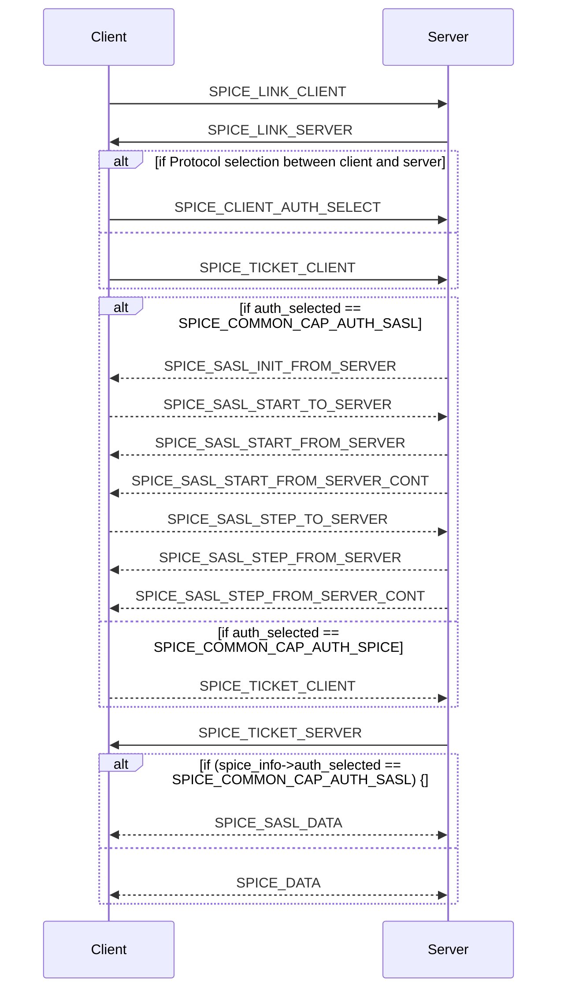

# spice 会话状态迁移图


## 状态描述
```bash
# Spice 会话状态
public enum SpiceSessionState {
    SPICE_LINK_CLIENT = 0, # 客户端链路消息状态
    SPICE_LINK_SERVER = 1, # 服务器链路消息状态
    SPICE_TICKET_CLIENT = 2, # 客户端票据状态
    SPICE_TICKET_SERVER = 3, # 服务器票据状态
    SPICE_CLIENT_AUTH_SELECT = 4, # 客户端认证方法选择状态
    SPICE_SASL_INIT_FROM_SERVER = 5, # 服务器发起的SASL初始化状态
    SPICE_SASL_START_TO_SERVER = 6, # 客户端向服务器发起的SASL认证开始状态
    SPICE_SASL_START_FROM_SERVER = 7, # 服务器发起的SASL认证开始状态
    SPICE_SASL_START_FROM_SERVER_CONT = 8, # 服务器发起的SASL认证开始（续）状态
    SPICE_SASL_STEP_TO_SERVER = 9, # 客户端向服务器发送的SASL认证步骤状态
    SPICE_SASL_STEP_FROM_SERVER = 10, # 服务器发送的SASL认证步骤状态
    SPICE_SASL_STEP_FROM_SERVER_CONT = 11, # 服务器发送的SASL认证步骤（续）状态
    SPICE_SASL_DATA = 12, # SASL数据状态
    SPICE_DATA = 13 # 数据状态
};
```
