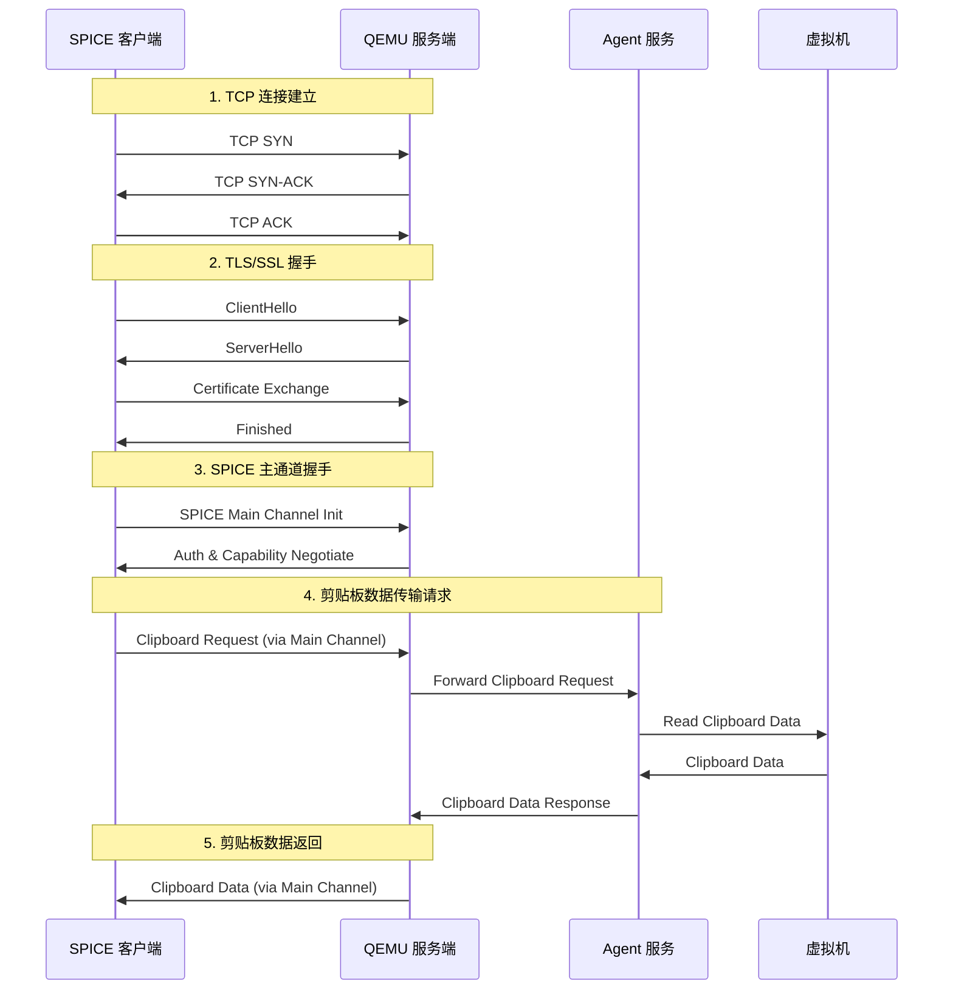

```mermaid
sequenceDiagram
    participant Client as SPICE 客户端
    participant QEMU as QEMU 服务端
    participant Agent as Agent 服务
    participant VM as 虚拟机

    Note over Client, QEMU: 1. TCP 连接建立
    Client->>QEMU: TCP SYN
    QEMU->>Client: TCP SYN-ACK
    Client->>QEMU: TCP ACK

    Note over Client, QEMU: 2. TLS/SSL 握手
    Client->>QEMU: ClientHello
    QEMU->>Client: ServerHello
    Client->>QEMU: Certificate Exchange
    QEMU->>Client: Finished

    Note over Client, QEMU: 3. SPICE 主通道握手
    Client->>QEMU: SPICE Main Channel Init
    QEMU->>Client: Auth & Capability Negotiate

    Note over Client, Agent: 4. 剪贴板数据传输请求
    Client->>QEMU: Clipboard Request (via Main Channel)
    QEMU->>Agent: Forward Clipboard Request
    Agent->>VM: Read Clipboard Data
    VM->>Agent: Clipboard Data
    Agent->>QEMU: Clipboard Data Response

    Note over QEMU, Client: 5. 剪贴板数据返回
    QEMU->>Client: Clipboard Data (via Main Channel)
```