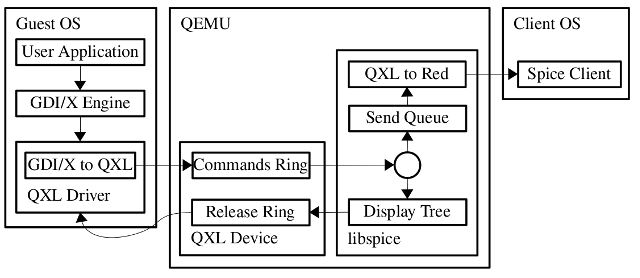
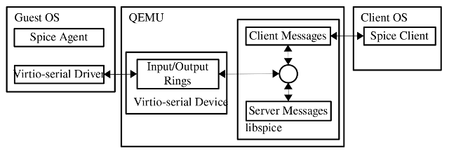
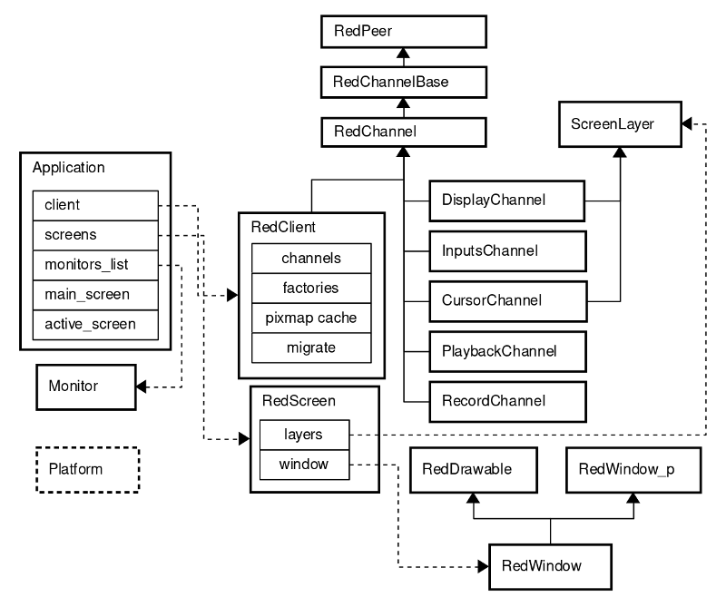
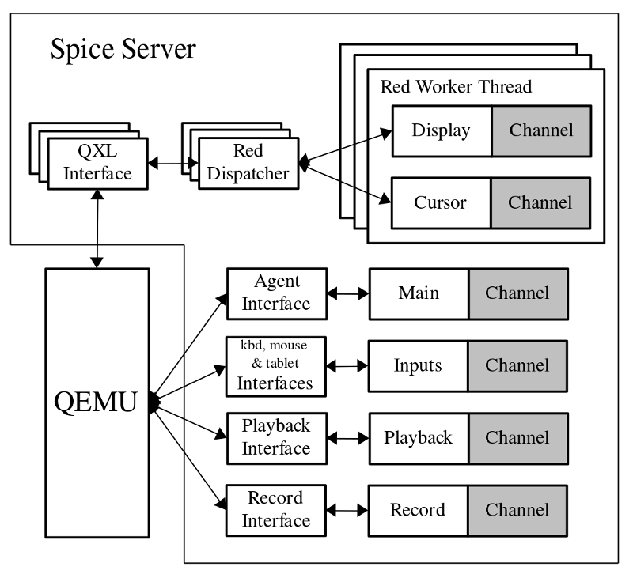
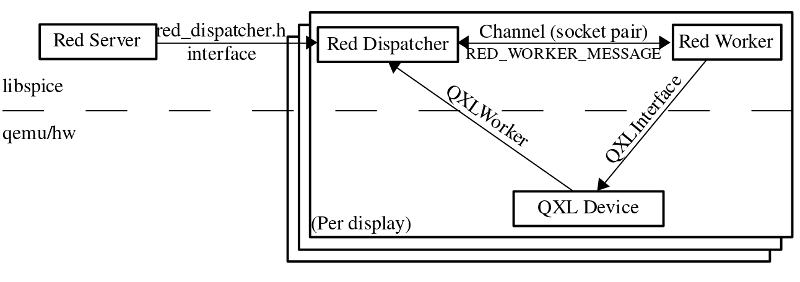

- [介绍](#介绍)
- [基本架构](#基本架构)
  - [1. 图形命令流程](#1-图形命令流程)
  - [2. 代理命令流](#2-代理命令流)
- [Spice 客户端](#spice-客户端)
  - [1 客户端基本结构](#1-客户端基本结构)
    - [1.1 客户端类](#11-客户端类)
    - [1.2 屏幕和窗口](#12-屏幕和窗口)
- [Spice 服务器](#spice-服务器)
  - [1. 服务器结构](#1-服务器结构)
    - [1.1 Red 服务器 （reds.c）](#11-red-服务器-redsc)
    - [1.2 图形子系统](#12-图形子系统)
- [Spice 协议](#spice-协议)
- [QXL 设备](#qxl-设备)
- [QXL 来宾驱动程序](#qxl-来宾驱动程序)
- [Spice Agent](#spice-agent)
- [特征](#特征)
  - [图形命令](#图形命令)
  - [硬件加速](#硬件加速)
  - [图像压缩](#图像压缩)
  - [视频压缩](#视频压缩)
  - [缓存](#缓存)
  - [鼠标模式](#鼠标模式)
  - [多个监视器](#多个监视器)
  - [2 路音频和口型同步](#2-路音频和口型同步)
  - [硬件光标](#硬件光标)
  - [实时迁移](#实时迁移)
  - [WAN 优化](#wan-优化)
  - [复制和粘贴](#复制和粘贴)

# 介绍
-------------
Spice 是一个开放的远程计算解决方案，为客户端提供对远程 机器显示器和设备（例如，键盘、鼠标、音频、USB）。Spice 实现了 用户体验类似于与本地计算机交互，同时尝试 将大多数密集型 CPU 和 GPU 任务卸载到客户端。香料是 适用于 LAN 和 WAN 使用，而不会影响用户 经验。

# 基本架构
-------------
Spice 基本构建块是 Spice 协议、Spice 服务器和 Spice 客户端。与 SPICE 相关的组件包括 QXL 设备和来宾 QXL 驱动程序。

## 1. 图形命令流程

上图显示了基本的 Spice 架构和 guest 到 client 数据 图形命令流，当将 libspice 与 QEMU 一起使用时。libspice 可以被 兼容的任何其他 VDI[Spice VD 接口文档]host 应用程序。图形命令 数据流由用户启动 请求操作系统图形引擎（X 或 GDI）以执行渲染的应用程序 操作。图形引擎将命令传递给 QXL 驱动程序，该驱动程序 将 OS 命令转换为 QXL 命令，并将其推送到命令环中。 命令环驻留在设备内存中。libspice 从 Ring 并将其添加到 Graphic Commands 树中。图形命令树 包含命令集，其执行将重现显示 内容。libspice 使用该树来优化命令传输到 client 通过删除被其他命令隐藏的命令来执行。命令树也是 用于视频流检测。libspice 还维护了一个命令队列，用于 发送到客户端，以更新其显示。当命令从 队列传输给客户端，则转换为 Spice 协议 消息。从树中删除的命令将从发送队列中删除，作为 井。当 libspice 不再需要某个命令时，它会被推送到 设备释放环。驱动程序使用此环来释放命令资源。 当客户端收到图形命令时，它使用该命令更新 显示。

## 2. 代理命令流

Spice 代理是在 guest 中执行的软件模块。Spice 服务器和客户端 将代理用于需要在来宾上下文中执行的任务，例如 配置 Guest Display 设置。上图显示了 Spice 客户端 以及使用 VDIPort 设备和客户机驱动程序与代理的服务器通信。 消息可以由客户端生成（例如，客户机的配置 Display settings（显示设置）、服务器（例如，鼠标移动）和代理程序（例如， 配置 ack）。驱动程序使用其输入与设备通信，并且 输出环。客户端和服务器生成的消息将写入同一写入 queue，然后写入设备输出环。消息 从设备输入环读取到服务器读取缓冲区。消息端口 确定邮件是应由服务器处理还是转发到 客户端。

# Spice 客户端
Spice跨平台（Linux和Windows）客户端是最终用户的界面。

## 1 客户端基本结构

### 1.1 客户端类

以下是对 Spice 客户端的关键类的介绍。因为拥有 一个干净的跨平台结构，Spice 定义了通用接口，保持 它们在 parallel 目录中特定于平台的实现。一个这样的通用 interface 是 Platform 类，定义了许多低级服务，例如 timer 和游标操作。

**Application** 是主类，它包含并控制客户端， 监视器和屏幕。它处理一般的应用程序功能，例如 解析命令行参数， 运行主消息循环， 处理事件 （连接、断开连接、错误等），将鼠标事件重定向到输入 处理程序、切换全屏模式等。

* 通道

    客户端和服务器通过通道进行通信。每种通道类型都是专用的 添加到特定类型的数据。每个通道都使用一个专用的 TCP 套接字，并且它可以 是安全的（使用 SSL）或不安全的。在客户端，每个通道都有一个 专用线程，因此可以通过区分 它们的线程优先级。

    **RedClient** 用作主通道。它拥有所有其他实例化的通道和控件 它们（使用他们的工厂创建通道、连接、断开连接等），并处理控制， 配置和迁移（使用 Migrate 类）。

    所有通道的父类是：

    * RedPeer - 用于安全和不安全通信的套接字包装器，提供基础设施，例如 作为 connect、disconnect、close、send、receive 和 socket swapping 进行迁移。它定义了 通用消息类：InMessages、CompoundInMessage 和 OutMessage。所有消息包括 type、 size 和 data。

    * RedChannelBase - 继承 RedPeer，提供建立频道的基本功能 与 服务器的连接并支持与 服务器的通道功能交换。

    * RedChannel - 继承 RedChannelBase。此类是所有实例化通道的父级。 处理发送传出消息和分派传入消息。RedChannel 线程运行 具有各种事件源（例如，Send 和 Abort 触发器）的事件循环。添加了 channel socket 作为触发 Spice 消息发送和接收的事件源。

    可用频道包括：
    * Main - 由 RedClient 实现（见上文）。
    * DisplayChannel - 处理图形命令、图像和视频流。
    * InputsChannel - 键盘和鼠标输入。
    * CursorChannel - 指针设备位置、可见性和光标形状。
    * PlaybackChannel - 从服务器接收的要由客户端播放的音频。
    * RecordChannel - 在客户端捕获的音频。
  ChannelFactory 是所有通道工厂的基类。每个通道都会注册其特定的 factory 的 API API 使 RedClient 能够按通道类型创建通道。

### 1.2 屏幕和窗口

ScreenLayer - 将 Screen Layer 附加到特定的屏幕，提供对矩形区域的操作 （set、clear、update、invalidate 等）。图层是 z 排序的（例如，光标位于显示上方）。

RedScreen - 使用屏幕层（例如 display， cursor） 来显示其内容

RedDrawable - 基本像素图的特定于平台的实现。它支持基本渲染 操作（例如，COPY、BLEND、COMBINE）。

RedWindow_p - 特定于平台的窗口数据和方法。

RedWindow - 继承 RedDrawable 和 RedWindow_p。跨平台实现基本窗口 状态和功能（例如，显示、隐藏、移动、最小化、设置标题、设置光标等）。

# Spice 服务器
--------------

Spice 服务器是在 libspice 中实现的，libspice 是一个虚拟设备接口 （VDI） 可插拔库。VDI 提供一种按软件组件发布虚拟设备接口的标准方法。这 使其他软件组件能够与这些设备交互。有关更多信息，请参阅 .服务器从一侧使用 Spice 与远程客户端通信 协议。从另一端，它与 VDI 主机应用程序（例如 QEMU）交互。 为了实现显示远程处理目的，服务器维护一个命令队列和一个树来管理 当前对象、依赖项和隐藏项。QXL 命令被处理并转换为 Spice 协议命令。 Spice 总是尝试将渲染任务传递给客户端，从而利用其硬件 加速能力。通过软件或 GPU 在主机端进行渲染，作为最后的结果完成。 Spice 服务器保留组成当前图像的客户机图形命令。它释放一个命令 仅当它完全被其他命令覆盖并且没有依赖项时，或者当我们 需要将命令渲染到帧缓冲区。触发绘制到 帧缓冲区是 （1） 资源耗尽;（2） 客户机需要从帧缓冲区读取。

## 1. 服务器结构

服务器通过通道与客户端通信。每个通道类型都专用于特定的 数据类型。每个通道都使用一个专用的 TCP 套接字，并且可以对其进行保护（使用 SSL）或 担保。服务器通道类似于客户端通道：Main、Inputs、Display、Cursor、 Playback 和 Record （有关更多信息，请参阅通道 2.3.2.1）

主通道和输入通道由处理程序函数（在 reds.c 中实现）控制。显示屏 光标通道由每个显示器的红色工作线程处理。音频播放和录制 通道有自己的处理程序 （snd_worker.c）。Libspice 和 VDI 主机应用程序（例如 QEMU） 通过为每个功能定义的接口（例如 QXL、代理、键盘、鼠标、 tablet、playback、record），如 中所述。

如上图所示，SPICE 服务器由以下主要组件组成：

### 1.1 Red 服务器 （reds.c）

服务器本身侦听客户端连接，接受它们并与之通信。 Reds 负责：

* 通道
  * 拥有和管理通道（register、unregister、shutdown）
  * 通知客户端有关活动通道的信息，以便客户端可以创建它们
  * 主通道和输入通道处理
  * 链接建立（main 和其他）
  * 套接字操作和连接管理
* 处理 SSL 和工单
* VDI 接口（例如核心、迁移、键盘、鼠标、平板电脑、代理）的添加和删除
* 迁移流程协调
* 处理用户命令（例如，来自 Qemu 监视器）
* 与来宾代理通信
* 统计

### 1.2 图形子系统

与 Spice 服务器中的其他子系统不同，图形子系统与服务器并行运行 执行，在专用线程（即 RED worker）上。此结构支持 QEMU 之间的独立性 流以及传入图形命令的处理和渲染，这可能会消耗大量 CPU 资源。上图显示了 Spice 服务器图形子系统结构。Red 服务器启动 dispatcher 在新的 QXL 接口（即 VDI）上。调度程序为该接口创建 red worker。 worker 处理的命令可以来自三个来源：（1） 同步的 QXL 设备 命令，（2） RED 服务器命令，（1 和 2）由 Dispatcher 使用套接字（即 socket pair），（3） 异步 QXL 设备命令，由 worker 从 QXL 设备环中提取 使用界面。

**红工 （red_worker.c）**

Spice 服务器为每个 QXL 设备实例保存一个不同的红色工作线程实例。这 red_worker 的职责是：

* 处理 QXL 设备命令（例如绘制、更新、光标）
* 处理从调度程序接收的消息
* 管道和管道项目
* 显示和光标通道
* 图像压缩（使用 quic、lz、glzencoding 和 jpeg）
* 视频流 - 识别、编码和流创建
* Cache - 客户端共享像素图缓存、光标缓存、调色板缓存
* 图形项目删除优化 - 使用项目树、容器、阴影、排除区域、 不透明项目
* Cairo 和 OpenGL（pbuf 和像素图）渲染器 - 画布、表面等。
* 环操作

**红色调度员 （red_dispatcher.c）**
* Dispatcher，每个 QXL 设备实例一个
* 封装来自 QXL 设备和 reds 的工作程序内部
* 为 QXL 设备实例启动工作线程并创建工作线程
* 使用 socketpair 通道分派 worker
* QXL 设备使用 QXLWorker 接口，该接口由 red 调度程序实现和附加 将设备调用转换为通过 RED 工作线程管道传输的消息。这样可以保持 两者分离且逻辑独立。
* Reds 将 red_dispatcher.h 中定义的接口用于 dispatcher 函数，例如 dispatcher 初始化、图像压缩更改、视频流状态更改、鼠标模式设置和 renderer 添加。

# Spice 协议

Spice 协议用于客户端-服务器通信，即传输图形对象， 键盘和鼠标事件、光标信息、音频播放和录制块以及控制 命令。Spice 协议的详细文档可以在
[Spice 远程计算协议定义]
中找到。

# QXL 设备

Spice 服务器支持 QXL VDI 接口。当 libspice 与 QEMU 一起使用时，特定的 QEMU QXL PCI 设备可用于提高远程显示性能和增强图形 客户机图形系统的功能。QXL 设备需要客户机 QXL 驱动程序才能获得完整 功能性。但是，当不存在驱动程序时，支持标准 VGA。此模式还会启用 虚拟机 （VM） 引导阶段的活动显示。设备使用 命令和光标响铃、显示和光标事件的中断以及 I/O 端口。其他 该设备的职责包括：

* 初始化设备 ROM、RAM 和 VRAM 并将其映射到物理内存
* 映射 I/O 端口并处理读取和写入以进行管理：区域更新、命令和光标 通知、IRQ 更新、模式设置、设备重置、日志记录等。
* 环 - 初始化和维护命令和光标环，从中获取命令和光标命令 响铃并等待通知。维护资源环。
* 使用 QXLWorker 接口与相应的 red worker 通信，实现并 由 RED 调度程序附加，后者将设备调用转换为写入和读取的消息 红色工人管道。
* 注册 QXLInterface 以使 worker 能够与设备通信。界面 包括 PCI 信息和函数，用于附加 worker、获取 display 和 cursor 命令 来自铃声、显示和光标通知、模式更改通知等。
* 定义支持的 qxl 模式并启用当前模式的修改，包括 vga 模式， 其中所有监视器都镜像单个设备（VGA 客户端）
* 在 VGA 模式下处理显示初始化、更新、调整大小和刷新

# QXL 来宾驱动程序

特定于平台的来宾驱动程序用于启用 QXL 设备并与之通信。这 Windows 驱动程序由一个与图形设备接口 （GDI） 配合使用的显示驱动程序组成 调用和结构，以及处理内存映射、端口和中断的微型端口驱动程序。

# Spice Agent

Spice Agent是一个可选组件，用于增强用户体验和执行面向来宾的操作 任务。例如，Agent在使用客户端鼠标时将鼠标位置和状态注入客户机 模式。它还支持在客户机和客户机之间复制/粘贴文本和图像。另外 它用于配置 Guest Display 设置。Agent由系统服务和一个用户进程组成。有一个 windows 和一个 linux 实现。

# 特征
----------
## 图形命令

Spice 支持传输和处理 2D 图形命令（3D 支持即将推出），如 与许多其他远程桌面解决方案中使用的帧缓冲区更新相反。The QXL 设备命令是通用的，并且与平台无关，因此 Windows 和 X 驱动程序都使用它们 本地。

## 硬件加速

基本的 Spice 客户端渲染是使用 Cairo 执行的，Cairo 是一个跨平台的 独立于设备的库。Cairo 提供用于 2D 绘图的矢量图形基元。 硬件加速是一种附加的渲染模式，在该模式下执行渲染 hardware 由客户端 GPU 而不是软件使用客户端 CPU。硬件加速是 在 Linux 中使用 OpenGL（实验性）实现，在 Windows 中使用 GDI 实现。.硬件加速 优点是：

* 高性能渲染 - 使用 OpenGL 时，Spice 客户端的渲染速度比 以前。繁重的软件操作，如拉伸（由视频流使用）要快得多 当由硬件执行时，而不是由软件执行时。因此，Spice 实现了更流畅的用户 经验。
* 降低客户端 CPU 使用率 - 客户端享有更多的 CPU 时间，可用于其他任务 比如音频。
* 与 Cairo 是一个独立的软件库不同，OpenGL 是一个依赖于 驱动程序和硬件实现。因此，Spice 可能会出现不正确的渲染、 CPU 使用率高，或者在最坏的情况下客户端或主机崩溃。此外，尽管 OpenGL 是一个 Global Standard 的 Discount S 中，硬件和驱动程序的实现在供应商之间发生了巨大变化。 因此，在不同的 GPU 上，Spice 可能会显示不同的渲染输出和不同的性能 可能会检测到。此外，有些设备根本不支持 OpenGL。

服务器还使用 OpenGL 进行硬件加速，与 Linux 客户端共享相同的代码。

## 图像压缩

Spice 提供了多种图像压缩算法，可以在服务器启动时选择，并且 在运行时动态。Quic 是 Spice 专有的图像压缩实用程序，它基于 SFALIC 算法
[Starosolski， R.： 简单、快速和自适应无损图像 压缩算法，软件实践与经验，2007,37（1）：65-91，DOI 10.1002/spe.746。
。 LZ （LZSS）](http://sun.aei.polsl.pl/~rstaros/papers/s2006-spe-sfalic.pdf)
[Lempel-Ziv-Storer-Szymanski： “通过文本进行数据压缩 替换“发表在 Journal of the ACM （pp. 928-951）]
算法中，根据图像进行调整后，是 另一种选择。Quic 和 LZ 都是本地算法，即它们独立编码每个图像。 Global LZ （GLZ） 是另一个 Spice 专有的，它使用 LZ 和基于历史的全局词典。 GLZ 利用图像之间的重复模式来缩小流量并节省带宽， 这在 WAN 环境中至关重要。Spice 还提供自动压缩模式 按图像选择 （selection-per-image），其中 LZ/GLZ 和 Quic 之间的选择以启发式方式基于图像 性能。从概念上讲，人工图像被 LZ/GLZ 压缩得更好，而真实图像则被压缩得更好 由 Quic 压缩得更好。

## 视频压缩

Spice 对发送到客户端的图像使用无损压缩，而不是有损压缩，以便 以避免中断重要的显示对象。但是，由于 （1） 视频流可以是主要的 bandwith 的消费者，因为每个视频帧都是一个独立的图像，并且 （2） 他们的内容主要是 uncritical，Spice 对此类流采用有损视频压缩：Spice 服务器启发式 通过识别以高速率更新的区域来识别视频区域。这些区域更新 作为使用易丢失的 Motion JPEG 算法 （M-JPEG） 编码的视频流发送到客户端。 这种机制可以节省大量流量，从而提高 Spice 性能，尤其是在 WAN 中。不过 在某些情况下，启发式行为可能会导致图像质量低下（例如，在识别 将文本区域更新为视频流）。视频流可以在服务器启动时选择，并且可以 运行时动态更改..

## 缓存

Spice 实现了客户端镜像缓存，以避免向客户端进行冗余传输。 缓存适用于发送到客户端的任何类型的图像数据，包括像素图、调色板和 游标。每个图像都来自驱动程序，具有唯一的 ID 和缓存提示。不相同的图像 具有不同的 ID，而相同的图像共享相同的 ID。缓存提示推荐服务器 以缓存图像。Pixmap 缓存在所有显示器之间共享。缓存是按连接定义的 并在服务器和客户端之间同步，即在服务器确切知道的每一刻 哪些图像在客户端缓存中。此外，服务器是决定项目是否 应从缓存中添加或删除。客户端缓存大小由客户端设置，并且 通过 Display Channel Initialization 消息传输到服务器。服务器监控 当前缓存容量，当空间不足时，它会删除最近使用最少的缓存项 直到有足够的可用缓存空间。服务器发送包含这些项目的 invalidate 命令 ，客户端删除它们。

## 鼠标模式

Spice 支持两种鼠标模式，服务器和客户端。模式可以动态更改并协商 在客户端和服务器之间。

* 服务器鼠标 - 使用 QEMU ps/2 鼠标仿真在客户机中启用鼠标。用户单击 在 Spice 客户端窗口中，客户端鼠标被捕获并设置为不可见。客户端发送鼠标 随着 delta 坐标移动到服务器。因此，客户端鼠标将返回到窗口中心 在每次移动后。在此模式下，服务器控制鼠标在显示屏上的位置，因此它始终是 在 Client 端和 Guest 之间同步。但是，在 WAN 上或加载的 server，其中鼠标光标可能会有一些延迟或无响应。

* 客户端鼠标 - 客户端鼠标用作有效的指针设备。它不会被捕获并且是 guest cursor 设置为不可见。客户端将鼠标移动作为绝对坐标发送到服务器。客人 代理缩放来宾虚拟桌面的坐标并注入相应的游标 位置。对于单个显示器，如果 VDI 主机，即使没有代理也可以使用客户端鼠标 应用程序注册绝对指针设备（例如，QEMU 中的 USB 平板电脑）。在这种情况下。这 Spice 服务器缩放坐标。客户端模式适用于 WAN 或加载的服务器，因为 光标具有平滑的运动和响应能力。但是，光标可能会丢失同步（position 和 形状）的客户端鼠标光标根据客户机鼠标光标进行更新。

## 多个监视器

Spice 支持任意数量的监视器，仅受客户机、客户端和服务器的约束 局限性。监视器的数量及其 RAM 大小是在启动 VM 时设置的。Spice 支持 根据 客户端计算机设置。这是通过对客户机代理的客户端命令实现的。

## 2 路音频和口型同步

Spice 支持音频播放和录制。播放使用 OPUS 算法进行压缩。 视频和音频之间的口型同步是通过在 QXL 设备中对视频帧进行时间戳来实现的，并且 将它们注入到客户端，与音频同步，这是独立的。

## 硬件光标

QXL 设备支持光标硬件加速。将光标与显示屏分离可以 优先考虑光标以获得更好的响应能力。此外，它还减少了网络流量。

## 实时迁移

服务器之间的 VM 迁移可以无缝地迁移到连接的客户端。完整的连接状态 包括打开的通道和光标，将保存在源上，并在目标上恢复。

## WAN 优化

服务器发送初始 ping 消息以确定延迟和带宽。如果他们是最糟糕的，那么 一个阈值，服务器告诉 guest 减少 guest 端功能，目前只在 Windows 来宾，减少位深度并禁用动画和壁纸，以及额外的图像 使用无损 JPEG 和 zlib-glz 进行压缩。如果其他操作（如 as 或 it 在无损编码中被重新发送。

## 复制和粘贴

当来宾代理运行时，支持在两者中复制和粘贴文本和图像 客户和客人之间的路线。# Spice 远程计算解决方案介绍
