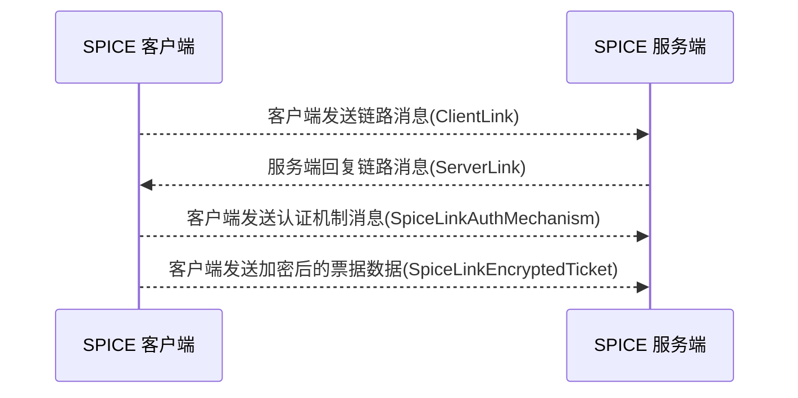
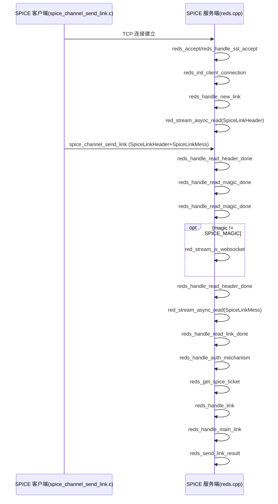

# 连接过程

## 协议交互


## 使用到的协议结构
```bash

# Spice 链路头
type SpiceLinkHeader = unit {
    magic: uint32;         # 魔数，用于标识协议
    major_version: uint32; # 主版本号
    minor_version: uint32; # 次版本号
    size: uint32;          # 消息体大小
};


# 链路消息 C2S 消息
type SpiceLinkMess = unit {
    connection_id: uint32;        # 连接ID，用于标识不同的连接
    channel_type: uint8;          # 通道类型，用于标识不同的通道类型
    channel_id: uint8;            # 通道ID，用于标识不同的通道
    num_common_caps: uint32;      # 通用能力数量，用于标识支持的通用能力数量
    num_channel_caps: uint32;     # 通道能力数量，用于标识支持的通道能力数量
    caps_offset: uint32;          # 能力偏移量，用于标识能力列表的偏移量
};

# Spice 链路回复 S2C 消息
type SpiceLinkReply = unit {
    error: uint32;                                    # 错误码，用于标识回复中的错误状态
    pub_key: bytes &size=SPICE_TICKET_PUBKEY_BYTES;    # 公钥，用于加密和解密数据
    num_common_caps: uint32;                           # 通用能力数量，用于标识支持的通用能力数量
    num_channel_caps: uint32;                          # 通道能力数量，用于标识支持的通道能力数量
    caps_offset: uint32;                               # 能力偏移量，用于标识能力列表的偏移量
};


public type ClientLink = unit {
    header: SpiceLinkHeader;
    message: SpiceLinkMess;
};

public type ServerLink = unit {
    header: SpiceLinkHeader;
    message: SpiceLinkReply;
};

# Spice 链路认证机制 C2S 消息
type SpiceLinkAuthMechanism = unit{
    auth_mechanism: uint32; # 认证机制，用于标识使用的认证机制
};

# 加密的票据数据 C2S 消息
type SpiceLinkEncryptedTicket  = unit{
    encrypted_data: bytes &size=128; # 存储加密后的票据数据的字节数组
};


```

## 代码调用过程

